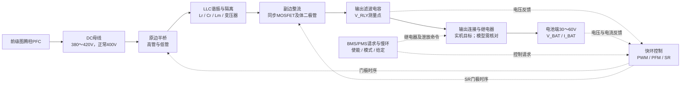
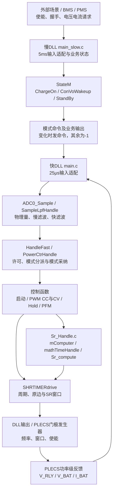
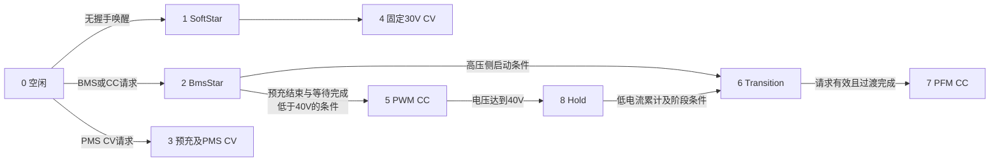

# 01 — LLC系统规格与框架讲解

版本：V0.3，2026-09-27。用途：在DLL已完成的基础上，建立系统规格、接口和验证边界。

2026-09-27用户确认：前级为图腾柱PFC，DC母线工作范围380～420V，正常400V。范围内是否全功率连续运行、纹波/瞬态容许值及保护阈值仍待确认。本次更新规格文档，未改变DLL或PLECS模型参数。

同日补充确认：输出接电池，电池端工作电压范围30～60V。电池类型、串数、是否覆盖多种电池包，以及最大连续充电电流仍待确认。60V是当前确认的范围上限，不直接作为所有电池的CV充电目标。

**本文件是待确认的系统规格草案。模型设定、代码限制、产品要求是三类不同证据，不应混写。**

本次优先讲解现有 `Visual studio projects/pi_controller` 工程及 `FullTest` 系列模型；最终版本待你确认。另有 `llc_loop`（10入8出）和早期 `LLC_Plecs_Port` 工程，不能混用它们的接口或仿真结论。本次只阅读源码和模型，未重新编译、运行或证明当前DLL二进制与源码一致。

读本文时先抓住一句话：**功率级负责传递能量，快环决定这一拍怎样开关，慢环决定现在允不允许充电、进入哪种业务状态。**

## 1. 系统框图

### 1.1 先划定系统边界

这里的LLC是一个隔离DC/DC功率变换级。已确认前级是图腾柱PFC：整机从交流取电，经PFC建立正常400V的DC母线，再由LLC隔离变换到输出端。LLC自身的功率输入范围为380～420V。`PFC_ok`是运行许可，不能代替母线电压值。



图中的继电器表示实机功能位置，不代表每个FullTest模型已经有电气继电器。当前试验资料中存在用采样偏置代替预充电压差的做法；这种方法能测试状态转移，但不能证明实际预充电路和合闸冲击已经通过。

### 1.2 从功率流理解每一部分

| 部分 | 做什么 | 理解时要抓住什么 |
|---|---|---|
| DC母线 | 提供输入能量 | 母线正常值、连续范围、瞬态范围与保护阈值分别定义 |
| 半桥 | 把直流变成高频激励 | 控制器不能直接“输出54V”，只能改变开关时序 |
| Lr、Cr、Lm | 与负载共同决定频率/脉宽到电压电流的关系 | 同样Duty或频率，在不同母线、负载下结果不同 |
| 变压器 | 隔离、变比与能量传递 | 变比并不能独自决定闭环输出电压 |
| SR整流 | 在合适时段以MOSFET导通降低整流损耗 | `SynDrv=1`只表示许可，仍需要正确的脉冲窗口 |
| 输出电容与继电器 | 滤波、预充、接入电池 | 继电器前后是两个节点，不能任意合成同一个电压 |
| 采样和控制 | 根据反馈调整功率 | 正负号、单位、采样时刻错误会直接改变控制方向 |

已读取的FullTest模型包含：Lr=`L14=20μH`，Cr=`C24=164nF`，外接Lm=`L7=100μH`，变压器`Tr3`绕组参数`[18 4 4]`，输出电容`C15=100μF`。这些是**仿真参数**，与实物磁性器件、容差及寄生参数的一致性待确认。

### 1.3 应用场景决定怎样验收

| 场景 | 控制目标 | 合适的负载/测量 | 需要观察 |
|---|---|---|---|
| 无电池唤醒 | 将继电器前端建立到约30V | 真正断开的电池支路、输出电容及泄放/轻载 | 启动时间、过冲、模式1→4 |
| 低压电池充电 | 跟踪CC电流，保持电压在允许范围 | 电池模型或能吸收能量的等效负载 | 模式2→5、Iref斜坡、实际电流 |
| 较高电压电池充电 | 在PFM区域调节电流 | 如42V电池场景，另核实串联电阻压降 | 5→8→6→7或启动直接2→6→7、频率及SR |
| PMS恒压供电 | 电压跟踪外部CV请求 | 电阻/电子负载，不能被更高电压理想源钳住 | 模式3预充及CV闭环、限流和负载响应 |
| 停机与故障 | 停止传能、按策略处理继电器和泄放 | 故障注入场景 | 门极封锁时间、故障锁存与恢复条件 |

**两个容易误解的例子：**

- 理想32V电池接在输出上，即使LLC没有开关，输出也可能被电池充到32V；“有电压”不等于LLC正在供电。
- 把理想电压源设成0V，通常等效为短路支路，不等于拔掉电池。无电池测试应断开支路或采用明确的空载模型。

### 1.4 老师先问你

1. 产品是电池充电器、通用恒压电源，还是两者都支持？主要负载是哪一种？
2. 你说的“输入范围”是整机AC范围，还是LLC端DC母线范围？
3. 输出规格定义在LLC电容端、继电器后连接器，还是电池端？线缆和串联电阻的损耗算在哪里？
4. 当前试验主要证明单个控制函数、自动状态机，还是实物功率级性能？这三者的通过条件不同。

## 2. 输入输出规格

### 2.1 规格总表：先保留未知项

“模型值”是当前测试设置；“代码值”是实现行为；“待确认”需要产品或硬件依据。未确认前不把380V/32V等单点扩展成额定工作范围。

| 项目 | 当前证据/观察 | 待冻结的系统要求 | 状态 |
|---|---|---|---|
| 前级来源 | 用户于2026-09-27确认；当前LLC模型用理想DC源代替前级 | 图腾柱PFC | 已确认 |
| 整机AC输入范围 | 本轮不能由DLL端口得出 | AC最小/额定/最大值及频率 | 待确认；不等于DC母线范围 |
| DC母线正常值 | 用户确认400V；此前读到模型`V_dc2=380V` | `Vbus_nom=400V` | 规格已确认；380V模型对应范围下限 |
| DC母线工作最小值 | 用户确认380V；未建立全范围扫描证据 | `Vbus_min=380V` | 电压边界已确认；全功率连续能力/降额待确认 |
| DC母线工作最大值 | 用户确认420V；未建立全范围扫描证据 | `Vbus_max=420V` | 电压边界已确认；全功率连续能力待确认 |
| 母线瞬态/启动范围 | 初始化`inV=350`，用于部分电容初值；不是电源设定 | 瞬态峰值、持续时间、启动条件 | 待确认；350V/380V初值需统一解释 |
| 母线保护 | `PFC_ok`有许可逻辑；快DLL没有Vbus模拟量输入 | UVLO/OVP关断值、恢复值、滤波时间 | 待确认；不可直接从许可位反推 |
| 正常工作点 | 正常母线已确认为400V；原仿真存在380V→32V/42V电池CC、30V CV | 400V / 输出电压___V / 输出电流___A / 温度___℃ | 母线已确认；输出与环境待确认 |
| 输出对象 | 用户确认接电池；CC模型采用32V或42V理想源加R16 | 电池；化学体系、串数、内阻/SOC待补充 | 负载类型已确认 |
| 电池端工作电压范围 | 用户确认30～60V；模式3请求范围与此数值一致，但不能代替能力验证 | `Vbat_min=30V`，`Vbat_max=60V`；变换器端还需计入线缆/继电器压降 | 电压规格已确认；全范围电流/功率能力待验证 |
| 电池启动窗口 | 当前ChargeOn逻辑含29≤Vbat<60V条件 | 合法电池电压与预充要求 | 代码条件，不是额定输出范围 |
| 最大连续电流 | PWM参考上限10A；PFM有`CON_CURR_OUT=16A`上限 | 热稳态`Iout_max=___A`，随电压/母线/温度降额 | 产品值待确认 |
| 最大功率 | 项目目标1600W；还有1500/1650宏，不能单看宏名称 | 1600W连续/峰值、持续时间、覆盖电压范围 | 待确认 |
| CC目标 | CC32V模型电流常量0.8A，CC42V模型4A | 各场景Ireq、精度、纹波、斜坡 | 模型设定，不是最大能力 |
| CV目标 | 模式4固定30V；模式3外部请求；CV30V模型设30V | 充电终止电压/供电电压、精度、限流 | 待确认 |
| 输出纹波/动态 | 本次没有验收数据 | 测量带宽、峰峰值、阶跃幅度与恢复时间 | 待确认 |
| 环境与散热 | 当前规格未定义 | 环境温度、风冷、器件温升及降额 | 待确认 |
| 效率与输入电流 | 不能用输出功率直接当输入功率 | 各工作点效率、输入电流上限 | 待确认 |

母线电流的估算关系为`Ibus≈Pout/(η_LLC×Vbus)`，这里η_LLC是LLC级效率。以1600W为例，380/400/420V下的理想平均输入电流分别约4.21/4.00/3.81A；实际还要计入损耗。这不是交流输入电流，也不是谐振电流或MOSFET峰值电流。

**这一组输入规格怎样影响设计：**400V是正常设计点，380V和420V是边界检查点。在输出电压和变比不变时，所需电压增益与母线电压成反比：380V下所需增益比400V高约5.26%，420V下低约4.76%。这是增益要求，不意味着可以按相同比例直接改Duty或频率；具体调节量取决于LLC谐振腔和负载。

后续应在三个母线点分别检查输出范围、轻载/满载与模式切换。380～420V先作为已确认的工作电压边界；它是否包含PFC纹波、是否要求全范围1600W，以及边界外的UVLO/OVP阈值仍需另定。不能直接把380V写成欠压关机值、420V写成过压关机值。

**电池30～60V意味着什么：**这是充电器需要适应的电池端电压范围，不能推断为一个电池包必须从30V充到60V，也不能推断CV目标统一为60V。CC阶段调节充电电流，电池端电压随电池状态变化；进入CV后应以该电池包允许的电压为目标。具体目标和转换条件由电池要求、BMS请求及充电策略确定。

在固定变比、忽略输出路径压降的条件下，最高增益要求对应380V母线/60V电池端，最低对应420V/30V。所需转换比的跨度为`(60/380)/(30/420)≈2.21`。这是电压转换比要求；各点能否满足电流、软开关和温升指标仍需验证。功率定义在电池端还是变换器端也需要最终确认。

### 2.2 1600W究竟对应什么工作点

先用`Pout=Vout×Iout`做一致性检查。下表电压均指**功率定义处的端口电压**；所需电流只是算术要求，不代表本机可以达到。

| 输出端口电压 | 达到1600W所需电流 | 若连续电流上限为30A时的功率上界 | 若上限为16A时的功率上界 |
|---:|---:|---:|---:|
| 30V | 53.33A | 900W | 480W |
| 32V | 50.00A | 960W | 512W |
| 40V | 40.00A | 1200W | 640W |
| 42V | 38.10A | 1260W | 672W |
| 48V | 33.33A | 1440W | 768W |
| 54V | 29.63A | 1620W | 864W |
| 58V | 27.59A | 1740W | 928W |
| 60V | 26.67A | 1800W | 960W |

上表30A来自头文件中存在的`OUTPUT_CUR_MAX`宏，仅作为条件计算；不能认定它已经成为有效限流值。16A列同样只是电流上限下的算术值，低于PFM电压入口的点不代表PFM可用。

由此得到两条判断：

- 如果产品最终上限为30A，1600W至少需要约53.33V，低压段应定义功率降额；不能同时要求32V、30A和1600W。
- 当前PFM参考仍被16A钳位，则即便端口达到60V，也只有960W的电流限幅上界；32V PWM段10A对应320W。要实现1600W必须先解释当前限流是否为调试设置，再检查硬件能力，不能只改一个常数。

当前`RefRampPfmCurr()`的功率约束可写为：

```text
P_allow = min(ACinVolRmsFir × 7.2, 1600)      [W，按代码语义]
I_limit = min(I_request, P_allow / Vbat_FIR, 16 A)
之后再按OTP等级降额，并将Iref缓变到I_limit。
```

这里用的是**交流RMS相关量**，不是380V DC母线。当前快DLL启动把它固定为220，因此该分支计算`P_allow=1584W`；但在30～60V区域通常先受到16A限制。这属于功率限幅，不等于独立恒功率闭环。

### 2.3 CC、CV与PWM、PFM分别回答不同问题

| 术语 | 回答的问题 | 当前系统示例 |
|---|---|---|
| CC恒流 | 要稳定哪个量？电流 | 模式5用PWM调电流；模式7用PFM调电流 |
| CV恒压 | 要稳定哪个量？电压 | 模式4固定30V；模式3跟随允许的外部电压请求 |
| PWM调制 | 怎样调整功率？改变脉宽 | 模式5基本保持80kHz，调整Duty |
| PFM调制 | 怎样调整功率？改变频率 | 模式7限制在60～250kHz，并计算SR窗口 |

所以“CC切CV”和“PWM切PFM”不是同一件事。电池电压越过40V触发调制模式切换，不等于电池已经充满，更不等于自动进入CV。CV请求被代码接受，也不等于谐振腔和占空比限制允许在所有负载下达到该电压。

### 2.4 当前试验负载为什么必须写清

CC32V/CC42V模型的`R16=5Ω`。若它在电容输出与电池源之间，则充电稳态近似有：

```text
V_converter = V_battery + I × R16
P_battery = V_battery × I
P_R16 = I² × R16
P_converter = P_battery + P_R16
```

以32V、4A、5Ω为例：变换器端需要约52V，电池得到128W，电阻消耗80W，变换器端约208W。这个场景不能当作“32V端口4A且没有额外损耗”。CC32V模型采用0.8A时，该近似得到36V，便于避开40V模式边界。

还需核对送入`vOut_Bat`的是电池源端还是电阻前Vout：同样名为Vbat，接到不同节点会让40V切换发生在不同工况。5Ω也不能未经说明就当成实物电池内阻。

### 2.5 本轮请你优先回答的规格问题

| 编号 | 请填写 | 为什么现在就要知道 |
|---|---|---|
| Q1（已答主要项） | 图腾柱PFC；DC母线380/400/420V；补充项：是否含纹波、是否全范围满功率 | 确定LLC需要覆盖的增益范围与降额边界 |
| Q2（已答主要项） | 电池负载，电池端30～60V；补充项：化学体系、串数、支持哪些电池包 | 确定CC/CV策略与额定功率口径 |
| Q3 | 最大连续电流；1600W连续还是峰值；在哪些电压保证 | 检查1600W与10A/16A限制的矛盾 |
| Q4 | 正常CC电流、CV电压；谁发请求、如何结束充电 | 区分调试常量与真实业务给定 |
| Q5 | 母线UV/OV、输出OV/OC、恢复条件 | 正常范围、降额范围、故障范围需要分开 |
| Q6 | 最终DLL工程、模型、编译配置及对应源码版本 | 锁定讲解和后续测试对象 |

可以直接这样回复：`前级=…；母线min/nom/max=…；负载=…；输出范围=…；Imax=…；1600W覆盖=…；CC=…；CV=…；最终工程=…`。不确定的项保留“待定”，不要为了填满表格猜数值。

## 3. MCU与功率级接口

### 3.1 实机接口与仿真替代关系

Keil工程指定`STM32G474RCTx`；代码定义系统时钟170MHz、HRTIM计算计数频率680MHz。这里680MHz是当前定时器公式采用的计数基准，不应称为CPU主频。

| 方向 | 信号/功能 | 实机侧 | 当前DLL/模型侧 | 必须明确的合同 |
|---|---|---|---|---|
| 功率级→MCU | V_RLY | 继电器前电压采样、ADC | Fast输入0，单位V | 真实节点、分压比例、初值 |
| 功率级→MCU | V_BAT | 电池侧电压采样、ADC | Fast输入1，单位V | 与V_RLY独立；偏置只用于指定测试 |
| 功率级→MCU | I_BAT | 输出电流传感/ADC | Fast输入2，单位A | 建议规定“向电池充电为正”，并核对Am方向 |
| 前级→MCU | PFC_ok | GPIO许可 | Fast输入3，0/1 | 不表示母线数值，也不是AC RMS |
| 通信→MCU | 使能、握手、Ireq、Vreq | CAN/BMS/PMS | 外部常量或Slow请求 | V/A与协议0.1单位转换只能做一次 |
| MCU→驱动器 | 原边高/低管时序 | HRTIM Timer C及门极许可 | PWM窗口+DrvH/DrvL→比较器→MOSFET | 极性、相位、死区、停波状态 |
| MCU→驱动器 | 同步整流时序 | HRTIM Timer D及SR许可 | SR窗口+SynDrv→副边MOSFET | 绕组极性、正向导通区、提前关断 |
| MCU→执行器 | 继电器/泄放/LLC许可 | GPIO及驱动电路 | 软件状态或模型开关 | 变量置位必须对应实际电气动作才算接通 |
| 硬件→保护链 | 过流/过压/温度等 | 比较器/故障输入/ADC/软件 | 当前8入Fast接口未完整覆盖 | 软件保护与硬件直接关断分开验收 |

DLL接收的是物理V/A。ADC比例用于实机数字码换算；当前包装再把Vreq/Ireq编码到0.1V/0.1A的CAN字段。把输入值预先乘0.1会再被缩放一次。

具体引脚号、驱动有效电平、采样带宽、隔离路径及硬件关断延迟需要原理图确认，不能仅凭函数名填写。

### 3.2 当前快DLL：8入17出

以下均为`inputs[]/outputs[]`的**0基数组索引**，不是子系统图标上的物理端子编号。依据`pi_controller/pi_controller/main.c`。

| 输入索引 | 名称 | 意义/单位 |
|---:|---|---|
| 0 | IN_VOUT_RLY | 继电器前电压，V |
| 1 | IN_VOUT_BAT | 电池侧反馈，V |
| 2 | IN_IOUT_BAT | 电流反馈，A |
| 3 | IN_PFC_OK | 前级许可，0/1 |
| 4 | IN_CTRMODE | ≥0每拍强制模式；-1交给内部状态机 |
| 5 | IN_VOLT_REF | 电压请求，V |
| 6 | IN_CURRENT_MAX | 电流请求/上限，A；内部还会限幅 |
| 7 | IN_HANDSHAKE | 0无握手、1 BMS、2 PMS |

| 输出索引 | 名称 | 含义 |
|---|---|---|
| 0 | Duty | 算法脉宽参数，不能直接解释为高低互补占空比 |
| 1 | SynDrv | SR许可，不是SR门极波形 |
| 2、3 | DrvH、DrvL | 原边高/低驱动许可 |
| 4 | Plv | 开关频率，Hz |
| 5 | CtrMode | 当前实际快环模式，用于观察 |
| 6～9 | SrOn1、SrOff1、SrOn2、SrOff2 | 相对于完整开关周期的归一化SR边沿位置 |
| 10～12 | SrA_s、SrB_s、SrD_s | SR时间量，秒 |
| 13～16 | PwmOn1、PwmOff1、PwmOn2、PwmOff2 | 相对于完整开关周期的归一化原边边沿位置 |

窗口连接原则为`gate = enable AND (phase >= on) AND (phase < off)`，其中phase应与当前完整开关周期一致；实际模型的周期更新方式、门极极性还需逐项核对。使用已导出的窗口可保留PWM/PFM的不同边沿位置。

例如PWM 80kHz、Duty=0.1时，原边两个窗口约为周期的`[0.20,0.30)`与`[0.70,0.80)`，各脉宽约1.25μs；不是一管10%、另一管90%。PFM则使用接近半周期、两端扣除死区的窗口。

### 3.3 当前慢DLL：8入6出

| 输入索引 | 名称 | 当前处理 |
|---:|---|---|
| 0～2 | V_RLY、V_BAT、I_BAT | 物理量；Slow中直接赋给部分FIR观察量 |
| 3 | CtrMode_obs | 当前包装明确未使用，不能认为已经反馈控制模式 |
| 4 | preOK | 输入预充阶段 |
| 5 | ChrgEna | 充电使能 |
| 6 | Handshake | BMS/PMS选择 |
| 7 | Vreq | 电压请求，V |

| 输出索引 | 名称 | 接线注意 |
|---:|---|---|
| 0 | CtrMode命令 | 模式变化时输出命令，否则-1；接Fast输入4 |
| 1 | Volt_Ref | 内部状态给定，确认有效时刻后再连接 |
| 2 | CurrentMax | 当前慢壳不能视为完整电流请求源；内部CAN请求写死4A，不代表这路输出必为4A |
| 3 | Handshake | 握手状态 |
| 4 | Relay | 慢DLL自己的继电器状态 |
| 5 | Discharge | 慢DLL自己的泄放状态 |

**当前接口的两个空缺：**Fast 17个输出没有`preOK`和自身继电器状态，因而不能直接完整反馈Slow所需状态；Slow没有外部Ireq输入，其CAN电流请求写死4A。不要把同名全局变量当作跨DLL通信。

当前`main_slow.c`已经在Handshake=2分支设置`xp_CVmode=2`；旧测试手册中“Handshake=1/2都强制CC”的描述已过时。另一方面，Slow设置的CVmode没有专门端口传入Fast，也不能据此断言两边CV状态已自动同步。

### 3.4 采样时间与开关时间

| 层级 | 当前设置 | 作用 |
|---|---|---|
| 快环算法 | Fs=40kHz，即25μs | 每拍采样、滤波、控制及更新驱动参数 |
| 当前Slow DLL | 5ms，即200Hz | 每次调用StateM；约200个快拍对应一次慢拍 |
| 开关发生器 | 由Plv决定 | 如80kHz=12.5μs、250kHz=4μs |
| Timer计数 | 当前公式680MHz | 将周期和边沿转换成计数；单计数约1.471ns |

固定25μs控制周期不意味着开关频率只能是40kHz。每个快拍可以覆盖多个开关周期。原固件还有1ms/100ms等调度；当前5ms慢DLL不能直接等同于全部原固件慢任务。模型Slow的1ns输出延迟用于调度/代数环处理，不是实机通信延迟指标。

### 3.5 接口课堂问题

1. 为什么`PFC_ok=1`不能证明母线电压一定正常？实际UV/OV由谁判断？
2. 为什么不能把快环输出CtrMode经延时后直接接回其强制模式输入？
3. 快环内部`RelayOn()`发生后，哪条真实模型连接会闭合继电器？若没有，该实验验证的是什么？
4. 你的最终模型怎样生成SR脉冲？是归一化窗口、单纯占空比，还是只接了使能？

## 4. 软件模块图

### 4.1 按职责理解，不按文件名猜快慢



图里的慢环是业务监督层，**当前电压PI和电流PI都在快环控制代码中**。`SHRTIMERdrive()`虽位于`ConsoleSlow.c`，却由`HandleFast()`调用；不能根据文件名把它放进5ms慢任务。

### 4.2 模块职责与模式

| 模块 | 主要函数 | 输入→输出 | 应用理解 |
|---|---|---|---|
| 物理量与滤波 | ADC0_Sample、SampleLpfHandle | V/A→原始值、FIR/LPF | 给不同控制/判据提供合适反馈 |
| 慢业务 | StateM、ChargeOn、ConVoWakeup | 握手/使能/测量→入口模式 | 决定何时启动、待机、充电 |
| 模式分派 | PowerCtrHandle、RequestMode | 当前模式与条件→下拍/同拍采纳模式 | 避免外部强制值覆盖内部转移 |
| 无握手启动 | SoftStart | 低输出电压→预充→模式4 | 无电池唤醒 |
| 有握手启动 | SoftCurStart | 电池电压及预充状态→模式5或6 | 充电入口 |
| PWM CC | ConCurrHandle | Iref-I反馈→Duty，80kHz | 较低电压区恒流 |
| 30V CV | ConVoltHandle | 30V-V反馈及电流限制→Duty，120kHz | 唤醒后维持输出 |
| PMS CV | ConVoltCurHandle、ConVoltHandleTwo | Vreq与反馈→预充及Duty，40kHz | 请求式恒压；范围须单独验收 |
| 调制切换 | ConPwmHoldHandle、ConTransHandle | 电流/计数/请求→Hold/过渡/PFM | 控制切换过程中的能量变化 |
| PFM CC | ConPfmHandle、RefRampPfmCurr | 电流误差、功率/温度限制→频率 | 当前60～250kHz控制区域 |
| PFM增益与SR | mComputer、mathTimeHandle、Sr_compute | 频率/电流等→增益和SR时间 | 查表和时间计算，不是仅开关一个SR标志 |
| 驱动适配 | SHRTIMERdrive | Plv/Duty/SR时间→边沿 | 实机写定时器，DLL导出窗口 |

模式编号：`0 NoSelect、1 SoftStar、2 BmsStar、3 SoftCurSt、4 ConVolt、5 ConCurPWM、6 Transition、7 OvLoadPFM、8 PwmHold`。



这张图仅画主要运行路径；故障、无效请求、PFC撤销等出口需另按源码验收。不能凭图自行添加PFM→PWM自动回切或Burst。持续强制`CtrMode=5`会在下一快拍覆盖内部模式，测试自动链时要让命令回到-1。

### 4.3 当前实现与完整实机系统的差别

| 核对项 | 当前源码事实 | 对讲解/验收的影响 |
|---|---|---|
| PFM/SR源码 | 已有Sr_Handle.c，快VS项目显式编译该文件 | 早期“缺三个库函数”的结论不再适用于本工程；仍需验证算法与实物匹配 |
| 软件保护 | ConsoleFast中SwOCP、动态OvFault、62V输出OV判定被`#ifndef PLECS_DLL`隔开 | DLL能运行控制模式，不代表这些保护也在DLL内运行 |
| 外部条件 | 快DLL将AC RMS初值置220；Slow初始化PFC_ok=1、delay_ini=100 | 部分原上电等待和前级变化被简化 |
| 请求/状态 | Slow简化映射Wakeup/Charging/Standby，未完整复现全部实机业务 | 模式跑通与完整CAN/整机状态机验收分别记录 |
| 全局状态 | 当前包装有文件static和全局控制变量 | 本次未证明同一DLL多实例隔离和所有函数static的重复启动复位 |
| 二进制版本 | 同名DLL有多份，模型多用无路径文件名加载 | 应冻结模型所在目录、DLL SHA256与编译配置，不能只看文件名 |

这些差别并不否定当前DLL的用途，它们界定了你能用它证明哪些结论：先验证控制律、模式路径和门极窗口，再逐项补齐整机接口与保护。

### 4.4 下一轮课堂与规格冻结顺序

1. **前级图腾柱PFC、母线380/400/420V、电池端30～60V已确认。** 下一步回答Q3：最大连续充电电流，以及1600W需要覆盖哪些电池电压。随后补充电池类型、CC/CV目标和最终工程版本，不急着讨论PI数值。
2. 将2.1表中的“待确认”改为正式数值，并给出每项来源：硬件要求、产品要求或测试结果。
3. 选择一个正常工作点，讲清“命令从哪里来→在哪限幅→哪个PI运行→输出哪个门极窗口→在哪反馈”。
4. 分别走一遍低母线满载、高母线轻载、无电池唤醒、CC到CV、PWM到PFM和故障停机；每个场景只使用对应的通过标准。
5. 最后整理Vbus/Vout/Iout/温度的可运行范围及降额表。1600W只是这个范围中的一部分，不能替代整张规格表。

## 附：本次核对来源

- [快环包装 main.c](<D:/Work/1600W/代码分析/Visual studio projects/pi_controller/pi_controller/main.c>)：8入17出、物理单位、全局初始化、220V RMS设定。
- [慢环包装 main_slow.c](<D:/Work/1600W/代码分析/Visual studio projects/pi_controller/pi_controller/main_slow.c>)：8入6出、固定4A、PMS CV映射及状态简化。
- [快环VS项目](<D:/Work/1600W/代码分析/Visual studio projects/pi_controller/pi_controller/pi_controller.vcxproj>)：PLECS_DLL宏及实际源码引用。
- [mathR02.c](<D:/Work/1600W/代码分析/R02_LLC_APP_V1.1.1_0824/AppUser/mathR02.c>)、[mathR02.h](<D:/Work/1600W/代码分析/R02_LLC_APP_V1.1.1_0824/AppUser/mathR02.h>)：控制模式、PI、限流与频率限制。
- [ConsoleFast.c](<D:/Work/1600W/代码分析/R02_LLC_APP_V1.1.1_0824/AppUser/ConsoleFast.c>)、[ConsoleSlow.c](<D:/Work/1600W/代码分析/R02_LLC_APP_V1.1.1_0824/AppUser/ConsoleSlow.c>)：保护编译边界、慢状态与定时器窗口。
- [Sr_Handle.c](<D:/Work/1600W/代码分析/R02_LLC_APP_V1.1.1_0824/AppUser/Sr_Handle.c>)、[HwConfig.h](<D:/Work/1600W/代码分析/R02_LLC_APP_V1.1.1_0824/AppUser/HwConfig.h>)：PFM/SR源码、硬件宏与计数基准。
- [CC32V模型](<D:/Work/1600W/代码分析/Visual studio projects/pi_controller/x64/Debug/LLC1600_PWM - DLL - test - Sr - Slow loop - dty - FullTest -CC- 32V.plecs>)、[CC42V模型](<D:/Work/1600W/代码分析/Visual studio projects/pi_controller/x64/Debug/LLC1600_PWM - DLL - test - Sr - Slow loop - dty - FullTest -CC- 42V.plecs>)、[CV30V模型](<D:/Work/1600W/代码分析/Visual studio projects/pi_controller/x64/Debug/LLC1600_PWM - DLL - test - Sr - Slow loop - dty - FullTest -CV-30V.plecs>)：本次读取的测试设定，均非额定范围证明。
- [另一套llc_loop接口](<D:/Work/1600W/代码分析/Visual studio projects/llc_loop/include/loop_abi.h>)：10入8出，两套合同不可互换。

本文件优先采用2026-09-24读取的源码；历史测试手册仅作线索。没有原理图、产品指标和验收结果支持的规格保留待确认。
