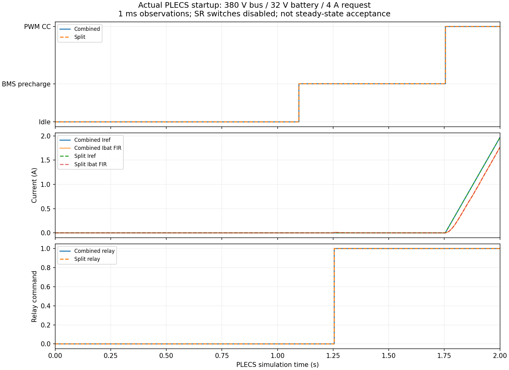

# 实施结果：PWM开发版

当前可用工程包含4个x64 DLL、组合/拆分快慢环电路模型、独立接口/门极/控制回放模型、VS2022解决方案、构建和验证脚本。

| 原计划步骤 | 当前状态 |
|---|---|
| 1 接口探针 | 已实现并在PLECS运行 |
| 2 电路与测量改造 | 已实现：继电器、泄放、继电器前/后电压、电流反馈 |
| 3 比较值和Gate | 已实现；PWM/PFM固定窗口实际PLECS边沿核对通过 |
| 4 实例化内核 | 已实现；数学/采样/双实例/复位测试通过 |
| 5 PWM三类控制 | 已移植并做核心测试；全工况电路验收未完成 |
| 6 启动和预充 | 三类启动已移植；BMS自动电路验证见下文，其余电路场景待做 |
| 7 PFM/SR库算法 | 未完成：缺mComputer/mathTimeHandle/Sr_compute的可移植实现 |
| 8 Hold/Transition | 状态和边界计数已测试；PFM入口按缺失算法关闭输出 |
| 9 慢业务和保护 | 已实现可用部分；完整SysReset/满电/温度/CAN边界仍未补齐 |
| 10 拆分快慢DLL | 已实现；2s回放80000快拍、45路逐拍相等 |
| 11 验证与交付 | 已提供工程与记录；不代表全模式及1600W验收完成 |

## 电路启动记录

组合版和拆分版均已完整运行2s，到达PWM恒流（模式5），继电器闭合，故障/诊断为0。末点Iref约1.967A、Ibat_FIR约1.764A，电流仍在爬升，不能作为4A稳态误差验收。

拆分版一次2s请求只返回1.095s，已排除；重跑返回完整2001点并通过终点检查。两版实际电路在1ms观察网格上的模式/继电器/预充/命令序号/快拍计数一致；Iref完全相同，Ibat_FIR最大差异约0.000075A，电压最大差异约0.000035V，TC比较值最多相差1个计数。连续电路的求解次序会引入小数值差异，不能把此结果说成所有电气量逐位相同。

| 观察时刻 | 两版共同结果 |
|---|---|
| 1.096s | 进入BmsStar（模式2） |
| 1.244s | preOK=1 |
| 1.255s | preOK=2，继电器闭合 |
| 1.755s | 进入ConCurPWM（模式5） |
| 2.000s | 80kHz，Iref约1.967A，Ibat_FIR约1.764A，无故障/诊断 |

求解器沿用Radau与RelTol=1e-3，本次长启动测试显式覆盖MaxStep=1e-6，记录间隔1ms。模式/继电器时刻按1ms采样观察，存在最多1ms的观察量化。PWM/PFM门极边沿来自另两份高分辨率独立仿真，不能由启动图推断死区。

## 可追溯记录

- `verification.json`：最后一次本机验证命令、退出码、输出及DLL SHA256。
- `startup_summary.json`、`startup_comparison.csv`：实际PLECS组合/拆分启动对照，由report_startup.py生成。
- `plecs_gate_waveforms.png`、`plecs_gate_edges.csv`：实际PLECS边沿；首个开/关边沿与680MHz计数公式误差小于0.1ps，无原边重叠，SR关闭。
- `multirate_replay.csv`：实际DLL统一输入回放，记录每1ms输出；测试在每25μs拍比较45路。
- `source_audit.json`：原目录变化与当前路径；旧分析仅保留哈希，不能还原全部历史文件差异。
- `model_baseline.json`：生成模型实际使用的冻结原模型SHA256。

最终MSVC x64 Debug构建通过；9组本机验证全部通过，PLECS探针/两种固定门极窗口/快环回放也重新运行通过。图表由实际PLECS返回的数据生成。使用`python tools/verify_port.py`可重跑本机验证；`tools/report_startup.py`和`tools/report_gate.py`需要matplotlib。

## 必须保留的限制

真实PFM/SR计算库源码缺失；当前进入PFM会报告诊断bit0并关闭输出。PWM SR的数值已迁移，但电气门极仍关闭。原目录的mathR02.c、user_sample.c、HwConfig.h已有新改动，另一个原模型新增控制子系统；本轮结果不能代表这些后续改动已合并或验证。

当前是PWM启动和控制联调基础，不是1600W定版。后续顺序见[验证矩阵](../config/scenario_matrix.md)，实际接线见[端口表](../config/port_map.md)。
