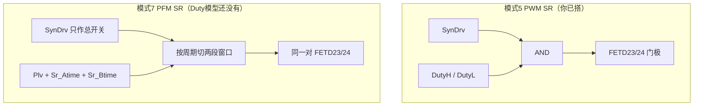

**硬件上只有一对同步管**（`FETD23` / `FETD24`），不是两套 SR。  
**软件上有两套开门算法**，共用 `SynDrv` 这个使能位：

| | PWM（模式 5、8） | PFM（模式 7） |
|---|---|---|
| 你现在搭的 | **就是这一套** | 还没搭 |
| 使能 | `Iout>4 A` 连续 25 ms 开，`<2 A` 关 | FIR`>6 A` 开，adc 或 FIR`<4 A` 关 |
| 门极形状 | 跟原边占空比走，略错开 | **查表窗口**，和 `Duty` 无关 |
| 原边 | `Duty` 0.02～0.40，`Plv=80 kHz` | `Duty` 固定 0.5，`Plv` 60～250 kHz |
| 窗口数据 | 固件里用 `Duty` 和固定 `Sr_Atime=200` | `Sr_Atime` / `Sr_Btime` 查表，单位是 HRTIM 计数 |

`SynDrv AND DutyH/L` 只对 PWM 成立。进模式 7 后原边接近 50%，再与门会变成「两管轮流开半周」，**不是**固件那套非对称窗口。

## PFM 窗口在固件里是什么

`ConPfmHandle` → `mathTimeHandle()` → `Sr_compute()` 查 `M_highPlv` / `M_lowPlv`，再写 Timer D：

```
周期 T = 1/Plv
半周 = T/2
死区 td ≈ 120 × 0.68 ns（计数）

窗口起点：td + Sr_Atime
窗口宽度：Sr_Dtime = T/2 − 2×td − Sr_Atime − Sr_Btime

一周期两发：
  前半周  [起点, 起点+宽度]
  后半周  [T/2+起点, T/2+起点+宽度]
```

频率分界 **102 kHz**：

- `Plv ≥ 102 kHz`：`Sr_Atime` 大（表值+200）×0.68，`Sr_Btime` 小（200×0.68）→ 窗口靠后、偏窄  
- `Plv < 102 kHz`：对调，窗口靠前  

`SynDrv=0` 时固件把比较值收成极窄脉冲，等于关 SR。



同一对管子，PWM 用占空比去切，PFM 用查表去切。

## Duty 模型上 PFM SR 怎么搭

现在 DLL **只出了 `SynDrv`**，**没出** `Sr_Atime` / `Sr_Btime` / `Sr_Dtime`，所以模式 7 **做不到和台架一样的窗口**。

分两档，先不要改代码：

**档 1 — 只验使能（先做到这个）**  
模式 7 仍用你现在的与门，或 `SynDrv` 去门「原边互补、带死区」的脉冲。  
能看到：电流过 6 A 后 `SynDrv=1`、门极开始跳；电流掉下 4 A 后关。  
窗口宽度不对，只能说明「PFM 会不会开 SR」，不能对台架波形。

**档 2 — 要对窗口（以后加 DLL 出口）**  
快环再出 3 个数（单位秒，抽壳里除以 `SHRTIMER_PLV=680e6`）：

- `tA = Sr_Atime / 680e6`
- `tB = Sr_Btime / 680e6`
- `tW = Sr_Dtime / 680e6`

模型里用 **同一把三角波，频率接 `Plv`**（这一点模式 7 比 PWM 更硬，PFM 就是变频）：

1. 锯齿 0～1，周期 `1/Plv`  
2. 前半周：`tA_norm < 锯齿 < tA_norm + tW_norm` → `SRH`  
3. 后半周：对后半周做同样比较 → `SRL`  
4. 再乘 `SynDrv`  
5. `tA_norm = (120 + Sr_Atime) / (680e6/Plv)`，`tW_norm = Sr_Dtime / (680e6/Plv)`

没有这 3 路出口，PLECS 里无法重现查表。

## 你现在该怎么用

- 模式 5：继续用已搭的 `SynDrv AND DutyH/L`，这就是 PWM SR。  
- 模式 7：先把三角波改吃 `Plv`，SR 仍用同一对与门只看 `SynDrv` 通断；窗口级以后再加 DLL 口。  
- 不要为 PFM 再做一对 FET，还是 `FETD23/24`。

`SynDrv` 门槛也不一样：PWM 要 4 A×25 ms，PFM 要 FIR>6 A。模式 5 里 1.25 A 时 `SynDrv` 为 0，和模式 7 不是同一套判据。