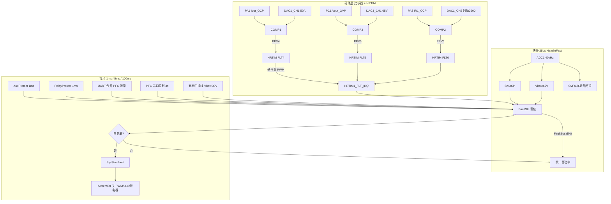
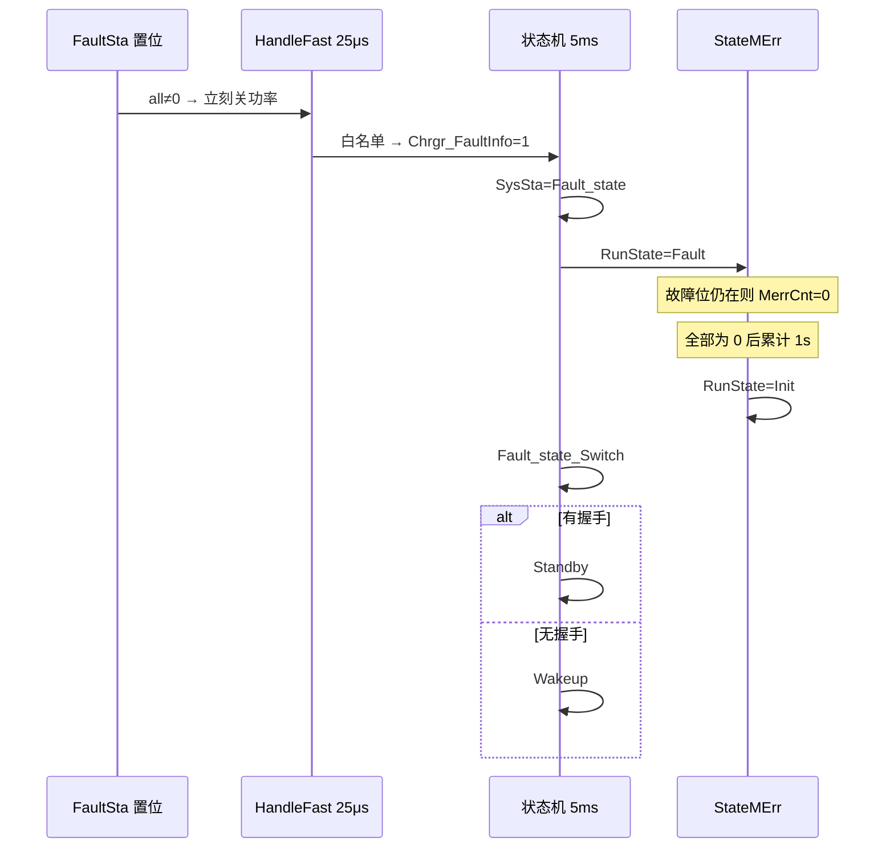

# R02 LLC APP V1.1.1 保护完整链路

本文按当前代码整理全部保护：信号来源、触发条件、级别、时间、处理与恢复。  
涉及：`ProtectionLLC.c`、`ConsoleFast.c`、`stm32g4xx_it.c`、`operateStatus.c`、`MODBUS_SLAVE.c`、`CAN_Control_2800W.c`、`main.c`。

---

## 1. 总链路（从采样到停机）

保护分四层，任一 `FaultSta` 位置 1，快环都会立刻停功率。是否切到应用故障态 `Fault_state`，另有一份白名单。



### 1.1 统一关功率（所有 `FaultSta` 共用）

发生点有三处，动作一致：

| 位置 | 周期 | 动作 |
|------|------|------|
| `HandleFast()` | 25 μs | 放电开、`LLC_Disable`、`PwmClose`、继电器关、`Curr_REF=0`、频率拉到 250 kHz |
| `HRTIM1_FLT_IRQHandler` | 硬件故障中断 | 先关同步管/半桥 GPIO，再同上；HRTIM 本身已硬件封锁输出 |
| `StateMErr()` | 5 ms（已进 Fault） | `PwmClose`、放电开、`LLC_Disable`、继电器关、`CtrMode=NoSelect` |

`PFC_OK=0` **不置 FaultSta**：放电开、PWM 关、`CtrMode=NoSelect`，但 **保持 `LLC_Enable`**，等 PFC 恢复。

---

## 2. 信号来源一览

| 物理信号 | 引脚 | 通路 | 软件变量 | 用途 |
|----------|------|------|----------|------|
| 继电器前电压 | PC2 ADC1_IN8 | ADC 40 kHz | `vOut_Rly_adc` | 继电器压差、软启 |
| 电池/输出电压 | PC3 ADC1_IN9 | ADC 40 kHz | `vOut_Bat_adc` / `_FIR` | 过压、短路、OvFault、欠压（代码已注释） |
| 输出电流 | PA0 ADC1_IN1 | ADC 40 kHz | `iOut_Bat_adc` / `_FIR` | 软件过流 42 A、短路 10 A |
| 12 V 辅源 | PA2 ADC1_IN3 | ADC + 滤波 | `AuxVolt` | LLC 辅源窗口 |
| 输出电流硬件比较 | PA1 COMP1+ | COMP vs DAC | HRTIM FLT4 | 硬件过流 50 A |
| 输出电压硬件比较 | PC1 COMP3+ | COMP vs DAC | HRTIM FLT5 | 硬件过压 65 V → `InterOv` |
| 谐振电流硬件比较 | PA3 COMP2+ | COMP vs DAC | HRTIM FLT6 | 谐振过流 → `ResonOc` |
| PFC 正常 | PC12 GPIO | 快环读电平 | `PFC_ok` | 暂停 LLC，不进故障字 |
| PFC 故障位图 | USART3 | 100 ms 一帧 | `pfc_DataFlowFace.FaultSta` | 输入侧/母线/PFC 硬件 |
| BMS2/PMS CAN | FDCAN 0x2F7/0x2DA | 1 ms 心跳 | `Xp_HandShake` | CAN 超时 |

比较器 DAC 门槛：

| DAC | 码值 | 折算 | 接到 |
|-----|------|------|------|
| DAC1_CH1 | `HW_DAC_OCP` ≈ 3102 | **50 A**（Iout×20 增益） | COMP1 输出过流 |
| DAC1_CH2 | `HW_DAC_ICP` = 2600 | ≈2.10 V（注释写 30 A 待确认，3 V≈40 A） | COMP2 谐振过流 |
| DAC3_CH1 | `HW_DAC_OVP` ≈ 3841 | **65 V**（Vout×21 增益） | COMP3 输出过压 |

比较器滞回 50 mV。COMP 的 EXTI 中断被 `PINGBI` 关掉，**软件不走 COMP IRQ**，只走 HRTIM Fault。

比较器上电 **1.9 s** 才 `HAL_COMP_Start`。软件 `Protect_comm` **2.0 s** 后才允许计时。

---

## 3. 故障位、级别、是否进 Fault 态

`FaultSta` 共 24 个有效位。CAN 协议里的 `Chrgr_FalutLevel` **恒写 0**，等级未实现。下表“级别”按**实际处理强度**划分：

| 级别 | 含义 |
|------|------|
| **HW** | 比较器 + HRTIM 硬件关波，中断锁存 |
| **F** | 快环 25 μs 锁存 `FaultSta`，立刻停功率 |
| **S** | 慢环软件（1 ms 防抖 / 通信超时） |
| **P** | PFC 串口灌入，LLC 只合并 |
| **L** | 局部闭锁，**不置 FaultSta**，不进 `Fault_state` |

`Chrgr_FaultInfo` 白名单（会把 `SysSta` 切到 `Fault_state`）：  
`ACin_oc, Vbus_ov, Out_uv, Out_oc, PFC_Err, LLC_Err, Out_short, outRLY_Err, inRLY_Err, CAN_Err, SCI_Err, ResonOc, LLC_otp, PFC_otp, InterOv`。

**不在白名单**的位：只要 `FaultSta.all≠0` 仍会停功率，但应用状态可停在 Charging/Wakeup。

| bit | 名称 | CAN 上报 | 来源 | 级别 | 进 Fault 态 | 当前是否生效 |
|-----|------|----------|------|------|-------------|--------------|
| 0 | ACin_ov | FAULT_IN_OV | PFC | P | 否 | 取决于 PFC |
| 1 | ACin_uv | FAULT_IN_UV | PFC | P | 否 | 取决于 PFC |
| 2 | ACin_oc | FAULT_IN_OC | PFC | P | **是** | 取决于 PFC |
| 3 | ACin_of | FAULT_AC_OVER_FREQ | PFC | P | 否 | 取决于 PFC |
| 4 | ACin_uf | FAULT_AC_UNDER_FREQ | PFC | P | 否 | 取决于 PFC |
| 5 | Vbus_ov | FAULT_BUS_OV | PFC | P | **是** | 取决于 PFC |
| 6 | Vbus_uv | FAULT_BUS_UV | PFC | P | 否 | 取决于 PFC |
| 7 | Out_ov | FAULT_OUT_OV | LLC 快环 Vbat≥62 V | F | **否** | **生效**（锁存） |
| 8 | Out_uv | FAULT_OUT_UV | 软件欠压（已注释） | S | 是 | **未调用** |
| 9 | Out_oc | FAULT_OUT_OC | HRTIM FLT4 / 快环 42 A | HW+F | **是** | **生效** |
| 10 | PFC_Err | FAULT_PFC_HW_ERR | PFC | P | **是** | 取决于 PFC |
| 11 | LLC_Err | FAULT_LLC_HW_ERR | 辅源窗口 1 ms | S | **是** | **生效** |
| 12 | Out_short | FAULT_OUT_SHORT | 快环 短路 | F | **是** | **生效** |
| 13 | PFC_otp | FAULT_PFC_OTP | PFC | P | **是** | 取决于 PFC；LLC OTP 已注释 |
| 14 | LLC_otp | FAULT_LLC_OTP | LLC OTP（已注释） | S | 是 | **未运行** |
| 15 | BAT_revs | FAULT_BATT_REVS | 无写入 | — | 否 | 空位 |
| 16 | inRLY_Err | FAULT_IN_RLY_ERR | PFC | P | **是** | 取决于 PFC |
| 17 | outRLY_Err | FAULT_OUT_RLY_ERR | 继电器压差 1 ms | S | **是** | **生效** |
| 18 | FAN_Err | FAULT_FAN_ERR | 无写入 | — | 否 | 空位 |
| 19 | CAN_Err | FAULT_CAN_CMM_ERR | 充电中掉线 | S | **是** | **生效** |
| 20 | INS_Err | FAULT_INSULATION_RES_Err | 无写入 | — | 否 | 空位 |
| 21 | SCI_Err | FAULT_SCI_CMM_ERR | PFC UART 超时 | S | **是** | **生效** |
| 22 | ResonOc | FAULT_RES_ERR1 | HRTIM FLT6 | HW | **是** | **生效** |
| 23 | InterOv | FAULT_RES_ERR2 | HRTIM FLT5 | HW | **是** | **生效** |

PFC 合并掩码 `0xFFFEDB80`：每次收到 PFC 帧，先清掉 PFC 拥有的位，再或上 PFC 位图。  
**PFC 拥有：** bit0–6、10、13、16（交流/母线/PFC 硬件/PFC 过温/输入继电器）。  
**LLC 保留：** 其余位，PFC 改不了。

---

## 4. 硬件比较器 + HRTIM（瞬时）

```
模拟量 > DAC
  → COMP 输出高（50 mV 滞回）
  → HRTIM EEV 电平灵敏、高极性
  → FLT4/5/6 硬件封锁 Timer C/D 输出
  → HRTIM1_FLT 中断
```

故障计数器阈值 = 0、无数字滤波，**比较器翻转即故障**。

### 4.1 FLT4 → `Out_oc`（输出硬件过流）

| 项 | 内容 |
|----|------|
| 信号 | PA1 `Iout_OCP` vs DAC1_CH1 **50 A** |
| 触发 | COMP1 高 → EEV4 → FLT4 |
| 时间 | 硬件周期级 + 中断 |
| 处理 | **仅当 `RelayOld==1`**（继电器已合满 2 s）才置 `Out_oc`；未满 2 s 只清标志，并重新启动 HRTIM |
| 进 Fault | 是 |
| 恢复 | **不自动清**。需市电掉到 RMS&lt;30 V，`SysReset` 清全部 `FaultSta` |

### 4.2 FLT5 → `InterOv`（硬件输出过压，CAN 名 FAULT_RES_ERR2）

| 项 | 内容 |
|----|------|
| 信号 | PC1 `Vout_OVP` vs DAC3_CH1 **65 V** |
| 触发 | COMP3 → EEV5 → FLT5 |
| 时间 | 瞬时 |
| 处理 | **不看继电器**，直接 `InterOv=1`，统一关功率 |
| 进 Fault | 是 |
| 恢复 | 锁存，直到交流掉电 `SysReset` |

与软件 `Out_ov`（62 V）是两条路：软件 62 V 置 bit7 且**不进 Fault 态**；硬件 65 V 置 bit23 **进 Fault 态**。

### 4.3 FLT6 → `ResonOc`（谐振过流）

| 项 | 内容 |
|----|------|
| 信号 | PA3 `IR1_OCP` vs DAC1_CH2 码值 2600 |
| 触发 | COMP2 → EEV6 → FLT6 |
| 时间 | 瞬时 |
| 处理 | 直接 `ResonOc=1` |
| 进 Fault | 是 |
| 恢复 | 锁存，直到 `SysReset` |

`SysProPara[6/7]` 里还有一套谐振过流、继电器前 65 V 的软件表，**没有任何函数调用**，硬件中断是唯一路径。

---

## 5. 快环软件保护（25 μs）

入口：`interrupt_ADC1` → `ADC0_Sample` → `HandleFast`。  
软件保护在 `powerOn≥2 s` 后比较器已开。`SwOCP` 额外要求 `RelayOld==1`。

### 5.1 软件输出过流 `Out_oc`

| 项 | 内容 |
|----|------|
| 信号 | `iOut_Bat_adc`（PA0） |
| 触发 | `Iout > 42 A` 且继电器已合 2 s，**单拍即锁存** |
| 时间 | 25 μs |
| 处理 | `FaultSta.Out_oc=1` → 统一关功率 |
| 进 Fault | 是 |
| 恢复 | 锁存，直到 `SysReset` |

`OutOcProtect()`（`Protect_comm` ID=2，42 A、20 次/200 ms）**从未被调度**。现网过流只有：快环 42 A + 硬件 50 A。

### 5.2 输出短路 `Out_short`

| 项 | 内容 |
|----|------|
| 信号 | `vOut_Bat_adc`、`iOut_Bat_adc` |
| 触发 | `RelayOld==1` 且 **Vbat &lt; 10 V** 且 **Iout &gt; 10 A**，单拍锁存 |
| 时间 | 25 μs |
| 处理 | `Out_short=1` → 关功率 |
| 进 Fault | 是 |
| 恢复 | 锁存，直到 `SysReset` |

### 5.3 软件输出过压 `Out_ov`

| 项 | 内容 |
|----|------|
| 信号 | `vOut_Bat_adc` |
| 触发 | **Vbat ≥ 62 V**，任意状态、单拍锁存 |
| 时间 | 25 μs |
| 处理 | 关功率 |
| 进 Fault | **否**（不在 `Chrgr_FaultInfo` 白名单） |
| 恢复 | **代码只置 1 不清 0**，只能交流掉电 `SysReset` |

`HwProtect()`→`OutOvProtect()`（唤醒相对 30 V+2 V、充电相对 60 V+2 V，可恢复）整段被注释，快环也不再调用。

副作用：充电中打到 62 V 时功率已停，但 `SysSta` 仍可能是 Charging，CAN `Chrgr_WorkSt` 仍报充电。

### 5.4 局部闭锁 `OvFault`（不进故障字）

仅 `CtrMode` 为 `ConCurPWM` 或 `OvLoadPFM`（CC 运行）时生效。

| 分支 | 条件 | 动作 |
|------|------|------|
| 电压飞升 | `Curr_REF>1 A`，且用 Iout&gt;1 A 时锁存的 `vtemp` 作基准，`Vbat ≥ vtemp+3 V` 且 `vtemp>30 V` | `OvFault=1`，`NoSelect`，放电开，继电器关 |
| 空载过压 | `Curr_REF>5 A` 且 `Iout<1 A` | 同上 |

| 项 | 内容 |
|----|------|
| 级别 | L，**不置 FaultSta**，不进 `Fault_state` |
| 时间 | 25 μs 触发 |
| 恢复 | `Vbat ≤ 58 V` 连续 **140000×25 μs ≈ 3.5 s** 后 `OvFault=0`，`Curr_REF=0`。期间 `ChargeOn` 因 `OvFault` 把 `OldState` 拉回 Init，3.5 s 后允许重新软启 |

---

## 6. 慢环 `Protect_comm` 引擎（1 ms）

当前真正调用的只有：

- `AuxProtect()`：1 ms，`faultID=3`，**不要求** `RelayOld`
- `RelayProtect()`：1 ms，`faultID=5`，**要求** `RelayOld`

上电 2 s 内函数直接返回原故障位，不检测。

### 6.1 判定算法（检测侧）

未故障时，每次调用 `TimeCount++`（封顶 20000）。  
输入越限则把当前 `TimeCount` 记入 `Delay[]` 并清零。凑满 `ErrNum` 次后：

- `ErrNum==1`：立刻故障  
- 否则：若 `sum(Delay) < DelayTimeA` → 故障  

本表 `ErrNum` 全是 20，`DelayTimeA` 辅源/继电器为 200。  
连续越限时每次间隔为 1，**20 次 × 1 ms = 20 ms 锁存**。  
间歇越限：20 次事件的间隔总和 &lt; 200 ms 也会锁存。

### 6.2 恢复侧

仅 `ClearEnable==1` 时，已故障后按 `Threshold_C/D` + `DelayTimeC` 清位。  
辅源、继电器 `ClearEnable=0` → **Protect_comm 不会自恢复**。

### 6.3 LLC 辅源 `LLC_Err`

| 项 | 内容 |
|----|------|
| 信号 | ADC1_IN3 → `AuxVolt`（约 12 V，增益 4.9，一阶滤波） |
| 触发 | `AuxVolt > 12.8 V` **或** `AuxVolt < 11.2 V` |
| 时间 | 连续约 **20 ms**（1 ms×20） |
| 处理 | `LLC_Err=1` → 关功率 → Fault 态 |
| 进 Fault | 是 |
| 恢复 | 不自动清，直到交流掉电 |

辅源在继电器未合时也检测（`faultID==3` 例外）。

### 6.4 输出继电器 `outRLY_Err`

| 项 | 内容 |
|----|------|
| 信号 | `vOut_Rly_adc − vOut_Bat_adc` |
| 触发 | 压差 **&gt;2 V 或 &lt;−2 V**，且继电器已合满 2 s |
| 时间 | 约 **20 ms** |
| 处理 | `outRLY_Err=1` → 关功率 → Fault 态 |
| 进 Fault | 是 |
| 恢复 | 不自动清，直到交流掉电 |

`RelayOld`：`OTP_Protection()` 每 5 ms 看 `RelaySta`，满 **400×5 ms = 2 s** 置 1。断继电器立刻清 0。这 2 s 窗口内硬件 FLT4 和软件 42 A/短路都不判。

---

## 7. 通信类保护

### 7.1 PFC 串口 `SCI_Err`

| 项 | 内容 |
|----|------|
| 信号 | USART3 DMA 收 PFC 周期帧 |
| 调度 | `UartCom` / `overTime_pfc`，**100 ms** |
| 触发 | 距上次 CRC 正确帧 `ctRoll` 差 **&gt;3000（3 s）**，且 `delay_ini≥100`（PFC_OK 后约 500 ms） |
| 处理 | `SCI_Err=1` → 关功率 → Fault 态 |
| 恢复 | 下一拍收到合法 PFC 帧：`SCI_Err=0`。OTA 暂停看门狗时强制清 0 |

### 7.2 CAN `CAN_Err`

| 项 | 内容 |
|----|------|
| 信号 | BMS2 0x2F7 / PMS 0x2DA，握手超时 3 s 清 `online` 对应位 |
| 触发 | **仅在 Charging** 且 `online==0` 且 **Vbat_FIR &gt; 30 V** |
| 时间 | 掉线判定 3 s，再在 5 ms 状态机里置位 |
| 处理 | `CAN_Err=1`，`SysSta=Fault` |
| 特殊 | 掉线且 Vbat≤30 V **不置 CAN_Err**，回到唤醒 |
| 恢复 | `online≠0` 时，`CAN_SendData_Run`（1 ms）把 `CAN_Err` 清 0 |

BMS2/PMS 各自独立超时 3 s；双在线 `online==3` 禁止充电但不置故障。

### 7.3 PFC 故障位合并

`rx_pfc_data()` 每次合法帧：

```
LLC.FaultSta &= 0xFFFEDB80;   // 清 PFC 拥有位
LLC.FaultSta |= PFC.FaultSta; // 灌入 PFC 当前图
```

因此 PFC 侧故障的**恢复节奏跟 PFC 板**：PFC 自己清位后，下一帧（约 100 ms）LLC 对应位也清掉。  
若清完后 `FaultSta.all==0`，走第 9 节公共恢复。

PFC 侧阈值/延时不在本工程，需对照 PFC 工程。LLC 只认位图。

---

## 8. PFC_OK 与交流掉电（非 FaultSta）

### 8.1 `PFC_OK` 引脚

| 项 | 内容 |
|----|------|
| 信号 | PC12，快环 25 μs 读 |
| 触发 | 低电平 |
| 处理 | 关 PWM、放电开、`NoSelect`、`OldState=Init`，**保持 LLC_EN=1** |
| 进 Fault | 否 |
| 恢复 | 引脚变高后快环重新 `PowerCtrHandle`；应用侧往往因 `OldState=Init` 重新走软启 |

### 8.2 `SysReset`（交流掉电总清）

`UartCom` 每 100 ms：

| 条件 | 动作 |
|------|------|
| `ACinVolRMS < 30 V` | `iniOk=0` |
| `ACinVolRMS > 60 V` 连续 4 拍（**400 ms**）且 `iniOk==0` | 重新开 HRTIM 输出/计数，`iniOk=1` |
| `iniOk==0` | **`FaultSta.all=0`**，`delay_ini=0`，`RunState=Init` |

这是硬件锁存故障（过流/短路/谐振/65 V/辅源/继电器/62 V）的**唯一软件恢复手段**。

---

## 9. 进 Fault 态之后的处理与恢复



`StateMErr`：`FaultSta.all==0` 后 **200×5 ms = 1 s** 才把 `RunState` 拉回 Init。  
`Fault_state_Switch` 只看 `Chrgr_FaultInfo`（白名单），不看 `FaultSta.all`。

因此会出现：

- `Out_ov`：功率已关，`SysSta` 仍是 Charging（不在白名单）。
- `SCI_Err` 收到一帧即清位：1 s 后可退出 Fault。
- `CAN_Err` 恢复通信即清位：同样 1 s 后可退出。
- `Out_oc` / `Out_short` / `ResonOc` / `InterOv` / `LLC_Err` / `outRLY_Err`：位不自己掉，会一直停在 Fault，直到交流掉电。

LED：Fault 态红灯（LED_OUT1）常亮。

---

## 10. 逐项完整卡片（当前生效）

### 10.1 输出硬件过流 `Out_oc`（FLT4）

- **链路：** Iout 比较电路 → PA1 → COMP1 vs 50 A DAC → EEV4 → FLT4 关波 → ISR（需 RelayOld）→ FaultSta → 快环停机 → 白名单 → Fault 态  
- **时间：** 硬件瞬时；继电器合上后 2 s 才允许锁存  
- **恢复：** 交流 RMS&lt;30 V 清字；再 RMS&gt;60 V 保持 400 ms 开 HRTIM；PFC_OK 后再 500 ms 才离开 Init  

### 10.2 软件过流 `Out_oc`（42 A）

- **链路：** PA0 ADC → `iOut_Bat_adc` → `SwOCP` → 同 10.1 后半  
- **时间：** 25 μs，无防抖  
- **恢复：** 同 10.1  

### 10.3 硬件过压 `InterOv`（65 V）

- **链路：** Vout 比较 → PC1 → COMP3 vs 65 V → FLT5 → ISR（无 RelayOld）→ 停机 + Fault 态  
- **时间：** 瞬时  
- **恢复：** 仅交流掉电  

### 10.4 软件过压 `Out_ov`（62 V）

- **链路：** PC3 ADC → Vbat≥62 → bit7 → 停机  
- **时间：** 25 μs  
- **级别差异：** 不停到 `Fault_state`，CAN 仍可报 Charging + FAULT_OUT_OV  
- **恢复：** 仅交流掉电（无回差清除）  

### 10.5 谐振过流 `ResonOc`

- **链路：** PA3 → COMP2 vs DAC 2600 → FLT6 → 停机 + Fault  
- **时间：** 瞬时  
- **恢复：** 仅交流掉电  

### 10.6 输出短路 `Out_short`

- **链路：** Vbat&lt;10 V 且 Iout&gt;10 A，继电器合满 2 s → 停机 + Fault  
- **时间：** 25 μs  
- **恢复：** 仅交流掉电  

### 10.7 辅源 `LLC_Err`

- **链路：** PA2 → AuxVolt 超出 11.2~12.8 V，约 20 ms → 停机 + Fault  
- **上电屏蔽：** 2 s  
- **恢复：** 仅交流掉电  

### 10.8 输出继电器 `outRLY_Err`

- **链路：** \|Vrelay−Vbat\| &gt; 2 V，合闸 2 s 后约 20 ms → 停机 + Fault  
- **恢复：** 仅交流掉电  

### 10.9 PFC 串口 `SCI_Err`

- **链路：** 100 ms 查询，3 s 无合法帧 → Fault  
- **恢复：** 收到合法帧立即清位，再等 Fault 态 1 s  

### 10.10 CAN `CAN_Err`

- **链路：** 3 s 无 BMS2/PMS → Charging 且 Vbat&gt;30 V → Fault  
- **恢复：** `online≠0` 立即清位，再等 1 s；Vbat≤30 V 掉线走唤醒，不置本故障  

### 10.11 PFC 灌入位（ACin_oc / Vbus_ov / PFC_Err / PFC_otp / inRLY_Err 等）

- **链路：** PFC 检测 → UART → 掩码合并 → 快环见 `all≠0` 停机；白名单位再进 Fault  
- **恢复：** 随 PFC 清位；然后 Fault 态 1 s  

### 10.12 CC 局部 `OvFault`

- **链路：** 快环，不进 FaultSta  
- **恢复：** Vbat≤58 V 保持 3.5 s 后允许再软启  

### 10.13 PFC_OK 丢失

- **链路：** PC12 低 → 暂停 LLC 功率，保持 LLC_EN  
- **恢复：** 引脚恢复，通常重软启  

---

## 11. 已写未跑 / 空位

| 功能 | 代码位置 | 状态 |
|------|----------|------|
| `OutOvProtect` 带恢复的过压 | `HwProtect()` 被注释 | 快环改成 62 V 只置位 |
| `OutUvProtect` / `OutUvConProtect` | 欠压 26 V | 未调度 |
| `OutOcProtect` 防抖过流 | Protect_comm ID2 | 未调度 |
| `SysProPara[6/7]` 谐振/继电器前过压 | 表有，无函数 | 由 HRTIM 代替 |
| OTP 四级降额 | `OTP_Protection` 主体全注释 | `ErrStaErr` 恒 0，PFM 降额不生效 |
| `Protect_Short()` | 仅声明 | 无定义 |
| `BAT_revs` / `FAN_Err` / `INS_Err` | 位存在且上报 | LLC 从不置 1，掩码也不让 PFC 写入 |
| `Chrgr_FalutLevel` | 协议 0~5 级 | 发送恒 0 |
| `Fault_Blocked` | `Sys_State` | 未使用 |

OTP 表（注释掉的设计，供对照）：7 路温度，四级 85/95/105 升额、降额回滞，约 1000×5 ms=5 s 升降一级；第 4 级同时置 `LLC_otp`+`PFC_otp`。现网温度只用于 CAN 上报最高温，不参与保护。

---

## 12. 时间总表

| 保护 | 检测周期 | 确认时间 | 关功率延迟 | 恢复 |
|------|----------|----------|------------|------|
| FLT4/5/6 硬件 | 模拟连续 | 瞬时 | HRTIM 当拍封锁 | 交流掉电 |
| 软件 42 A / 短路 / 62 V | 25 μs | 1 拍 | 同拍 | 交流掉电（62 V 不进 Fault 态） |
| 辅源 / 继电器压差 | 1 ms | ≈20 ms | 下一拍快环 | 交流掉电 |
| 继电器允许过流窗口 | 5 ms | 合闸 2 s | — | 断开即清 RelayOld |
| SCI | 100 ms | 3 s | 置位后 25 μs 级 | 收包即清 + Fault 1 s |
| CAN | 1 ms 超时计数 | 3 s + 5 ms | 同上 | 握手恢复即清 + Fault 1 s |
| OvFault | 25 μs | 1 拍 | NoSelect，不断 FaultSta | Vbat≤58 V 保持 3.5 s |
| PFC_OK | 25 μs | 1 拍 | 暂停，保持 LLC_EN | 引脚恢复 |
| 比较器使能 | 1 ms | 上电 1.9 s | — | — |
| Protect_comm 使能 | 1 ms | 上电 2.0 s | — | — |
| 交流恢复开 HRTIM | 100 ms | RMS&gt;60 V ×400 ms | — | — |
| Fault 态退出 | 5 ms | 故障字全 0 后 1 s | — | Standby 或 Wakeup |
| PFC 位跟随 | UART | 约 1 帧（100 ms 量级） | 合并后快环 | PFC 清位 |

---

## 13. 源文件索引

| 内容 | 文件 |
|------|------|
| 保护参数表、Protect_comm、辅源/继电器、SysReset | `AppUser/ProtectionLLC.c` `.h` |
| 快环过流/短路/62 V/OvFault/统一停机 | `AppUser/ConsoleFast.c` |
| HRTIM 故障中断 | `Core/Src/stm32g4xx_it.c` |
| 比较器、DAC、HRTIM EEV/FLT | `Core/Src/main.c` |
| 引脚 | `Core/Inc/main.h`、`stm32g4xx_hal_msp.c` |
| 故障白名单、CAN_Err、Fault 态切换 | `AppUser/operateStatus.c` |
| PFC 位合并、SCI 超时 | `AppUser/MODBUS_SLAVE.c` |
| CAN 故障上报、握手超时 | `AppUser/CAN_Control_2800W.c` |
| 采样通道 | `AppUser/user_sample.c` |
)
