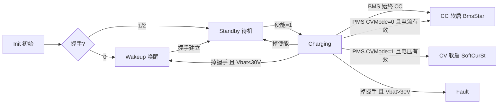
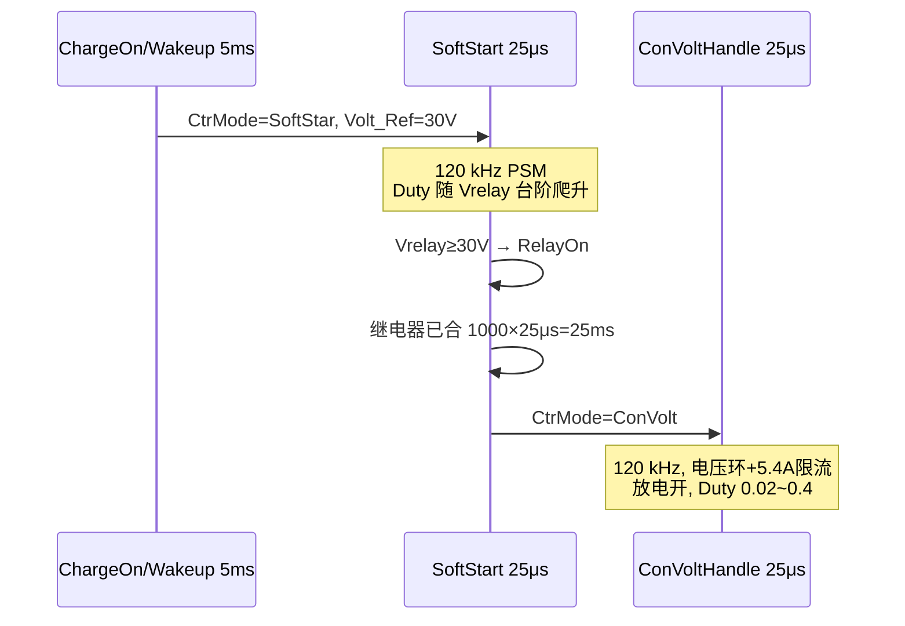
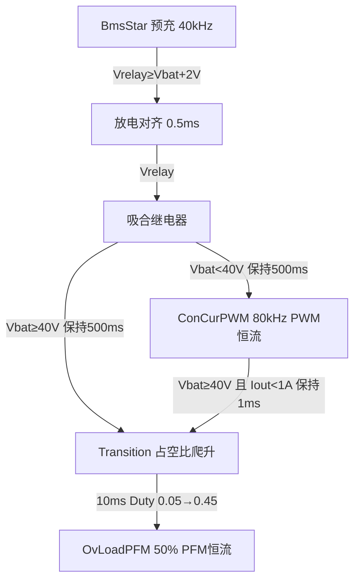

# R02 LLC APP V1.1.1 各环节时序说明

本文按当前代码（`AppUser/operateStatus.c`、`ConsoleSlow.c`、`mathR02.c`、`ConsoleFast.c`）整理三套业务环节、CC/CV 切换、软启、爬波及全部关键时序。

---

## 1. 时间基准

| 基准 | 来源 | 周期 | 用途 |
|------|------|------|------|
| 快环 40 kHz | TIM3 触发 ADC1 DMA（PSC=16，ARR=249，APB1=170 MHz） | **25 μs** | `HandleFast()` → `PowerCtrHandle()`、PWM 更新、电流爬坡 |
| 慢环 1 kHz | SysTick `HAL_IncTick()` | **1 ms** | 上电计时、继电器/辅源保护、CAN 心跳 |
| 状态机 200 Hz | `delay_Slow` 每 5 ms 一轮 | **5 ms** | `runMainStateMachine()`、`StateM()`、`ChargeOn()` |
| CAN 发送 | `CAN_SendData_Run()` 每 1 ms 调一次，满 100 拍发送 | **100 ms** | 0x2D5 状态帧 |
| CAN 超时 | `ctRoll` 每 1 ms +1，超时 3000 | **3 s** | BMS2 / PMS 掉线清握手 |

**电流爬坡换算（快环）：**

- `Curr_REF += 0.0002 A / 25 μs` → **8 A/s**
- 0 → 16 A 理论最短约 **2.0 s**

---

## 2. 三套环节总览

握手来自 CAN：`xp_HandShake`

| 值 | 含义 | 典型对象 | 充电路径 |
|----|------|----------|----------|
| 0 | 无握手 | 空载/未连电池通信 | **环节 A：30 V 恒压唤醒** |
| 1 | BMS2 | 电池包 | **环节 B：仅 CC** |
| 2 | PMS | 机器人 | **环节 C：CC 或 CV** |
| 3 | 双在线 | 同时收到 BMS2+PMS | 强制改成 2，且 `online==3` 时禁止充电、锁在待机 |



应用状态 `gSys_State.SysSta` 与功率状态 `DataFlowFace.RunState` 枚举对齐：

| 值 | SysSta | RunState | 功率入口 |
|----|--------|----------|----------|
| 0 | Initial_state | Init | `StateMInit()`，关 PWM |
| 1 | ConstantVoltWackup_state | Wakeup | `ConVoWakeup()` |
| 2 | ChargeStandby_state | Stadby | `StandBy()` |
| 3 | Charging_state | Charging | `ChargeOn()` |
| 4 | FullCharged_state | FullCharged | `ChargeFull()`（当前无入口切到此状态） |
| 5 | Fault_state | Fault | `StateMErr()` |

`RunState` 必须等 `delay_ini ≥ 100`（PFC_OK 后约 **500 ms**）才跟随 `SysSta`。此前功率侧一直停在 Init。

---

## 3. 上电公共时序

```
t=0          复位、外设初始化
t=400 ms     市电 RMS>60 V 连续 4 拍（UartCom/SysReset 每 100 ms）→ 开 HRTIM
t=500 ms     PFC_OK 累计 delay_ini=100 → RunState 才允许离开 Init
t=1.9 s      打开比较器 COMP1/2/3
t=2.0 s      软件保护 Protect_comm 开始计时
继电器吸合后 2 s  RelayOld=1 → 才允许输出过流/短路判定
```

故障恢复：`StateMErr` 在故障全清后等 **200×5 ms = 1 s** 回到 Init。

过压闭锁 `OvFault`：快环内置位后，`Vbat≤58 V` 累计 **140000×25 μs ≈ 3.5 s** 才允许再次软启。

---

## 4. 环节 A：无握手恒压唤醒（HandShake = 0）

### 4.1 进入条件

- `SysSta = ConstantVoltWackup_state`
- `Vrelay < 28 V` 且 `Vbat < 5 V` 且继电器未吸合，连续 **3×5 ms = 15 ms**

不满足则：放电开、继电器关，不进软启。

### 4.2 控制链

`SoftStar` → 预充到 30 V → 吸合继电器 → 等 25 ms → `ConVolt` 30 V 恒压



### 4.3 软启占空比台阶（`SoftStart`，f = 120 kHz）

| 继电器前电压 Vrelay | Duty |
|---------------------|------|
| ≤10 V | 0.035 |
| >10 V | 0.040 |
| >15 V | 0.044 |
| >20 V | 0.047 |
| >25 V | 0.050 |

目标：`Volt_Ref = 30 V`。未到 30 V 期间放电关、继电器关、DrvH/DrvL 开。

### 4.4 恒压运行（`ConVoltHandle`）

- 电压环：`Kp=0.04，Ki=0.001`，给定跟踪 `min(Vrelay+0.01, 30 V)`
- 电流限幅环：给定 5.4 A
- Duty 上限 0.4；Duty < 0.02 关高边
- **放电始终打开**（空载稳 30 V）
- 频率固定 **120 kHz**

### 4.5 退出

握手变为 1 或 2 → Standby（`CtrMode=NoSelect`，关 PWM，放电开，继电器关）。

---

## 5. 环节 B：BMS 恒流充电（HandShake = 1）

BMS **强制 CC**：`ChargeOn()` 里 `xp_CVmode = 1`，没有 CV 路径。

### 5.1 进入充电

Standby 且 `BMS2_ChrgEna=1` → `Charging`。

`ChargeOn()` 启动 CC 软启需同时满足（每 5 ms 判断）：

1. 刚进 Charging，或 CC/CV 模式发生变化
2. `OvFault == 0`
3. `iOut_FIR < 1 A`
4. `Vrelay < Vbat - 2 V`
5. 请求电压 `BMS2_ChrgReqVolt×0.1 ≥ 30 V`
6. `29 V ≤ Vbat < 60 V`
7. 条件连续成立 **40×5 ms = 200 ms**

然后：`CtrMode = BmsStar`，`Curr_REF=0`，`preOK=0`，`litate=0`，`Volt_Ref = Vbat+2 V`。

### 5.2 CC 软启 `SoftCurStart`（BmsStar）

分四拍，全部在 40 kHz 快环：

| 拍 | 条件 | 动作 | 时序 |
|----|------|------|------|
| litate=0 预充 | `preOK=0` | 放电关、继电器关，40 kHz，Duty 按 Vrelay 台阶 | 直到 `Vrelay ≥ Vbat+2 V` |
| litate=1 对齐 | `preOK=0` | 放电开、继电器关，PWM 关 | `Vrelay ≥ Vbat+0.5 V` 保持 **20×25 μs = 0.5 ms** → `preOK=1`；若掉到 `< Vbat+0.5 V` 退回 litate=0 |
| preOK=1 吸合 | `Vrelay < Vbat+0.2 V` | 放电关，继电器吸合 | 对齐保持 **0.5 ms** 后 `RelayOn`，`preOK=2` |
| preOK=2 等待 | 继电器已合 | PWM 关，放电关 | 见下表分流 |

**预充 Duty 台阶（40 kHz）：**

| Vrelay | Duty |
|--------|------|
| <10 V | 0.01 |
| <20 V | 0.02 |
| <30 V | 0.03 |
| <40 V | 0.04 |
| <50 V | 0.06 |
| ≥50 V | 0.07 |
| Vrelay > Vbat 时强制 | 0.05 |

**继电器吸合后分流（滞回）：**

| 电池电压 | 保持时间 | 下一模式 |
|----------|----------|----------|
| Vbat < 40.0 V | **20000×25 μs = 500 ms**（Vbat>40.5 V 清零） | `ConCurPWM` 低压 PWM 恒流 |
| Vbat ≥ 40.0 V | **500 ms**（Vbat<39.5 V 清零） | `Transition` → 高压 PFM 恒流 |



### 5.3 低压 PWM 恒流 `ConCurPWM`（`ConCurrHandle`）

- 频率 **80 kHz**，半桥 Duty 环，上限 0.4
- `CurrentMax = BMS2_ChrgReqCur × 0.1`，再限幅 **10 A**
- `CurrentMax ≤ 0.1 A`：关驱动，`Curr_REF=0`
- 爬波：`Curr_REF` 以 8 A/s 追 `CurrentMax`，且只能在 `|Curr_REF − Iout| < 1 A` 时继续爬（防空载猛冲）
- 电流误差限幅 ±0.2 A 后再进 PI（Kp=0.0005，Ki=0.001）

**PWM → PFM 切换（psmSwitch）：**

| psmSwitch | 条件 | 动作 | 时间 |
|-----------|------|------|------|
| 0 | 正常 PWM 恒流 | `ConCurrHandle` | — |
| 1 | `Vbat ≥ 40 V` | 关高边，Duty=0.02，`Curr_REF=0`，f=80 kHz | 等到 `Iout < 1 A` 连续 **40×25 μs = 1 ms** |
| 2 | 电流已掉下去 | Duty=0.05，进 `Transition` | 立即 |

### 5.4 过渡 `Transition`（占空比爬波）

仅当 `CurrentMax > 0.5 A`：

- 频率拉到 **250 kHz**，DrvH/DrvL 开，同步管关
- `Duty = 0.05 + time×0.001`，`time` 每 25 μs +1
- `time ≥ 400` → **10 ms** 后进入 `OvLoadPFM`
- Duty 从 **0.05 爬到 0.45**

`CurrentMax ≤ 0.5 A`：关驱动，停在 Transition 等请求电流变大。

### 5.5 高压 PFM 恒流 `OvLoadPFM`

- 固定 Duty = **0.50**，调频：60 kHz ~ 250 kHz
- `CurrentMax` 取 BMS 请求，再被功率上限裁剪：
  - `Imax ≤ Vac_rms × 7.2 / Vbat`（再限 1600 W）
  - `Imax ≤ CON_CURR_OUT = 16 A`
  - OTP 降额：`ErrStaErr==1` ×0.75，`==2` ×0.50
- `Curr_REF` 以 **8 A/s** 爬向 `CurrentMax`
- `Vbat < 39 V` 或握手丢失：关 PWM（不自动退回 PWM 模式）
- `CurrentMax ≤ 0.5 A`：退回 `Transition`

同步整流：`Iout>4 A` 持续 **1000×25 μs = 25 ms** 才开 SR；`Iout<2 A` 立即关。

---

## 6. 环节 C：PMS 机器人 CC / CV（HandShake = 2）

### 6.1 模式判定（5 ms 一次，仅 PMS）

`Charging_state_Function()`：

| `PMS_CVModeReq` | 附加条件 | `xp_CVmode` | 含义 |
|-----------------|----------|-------------|------|
| 0 | `PMS_ChrgReqCur ≥ 1`（0.1 A LSB，即 ≥0.1 A） | 1 | CC |
| 1 | `PMS_ChrgReqVolt ≥ 30`（原始量，约 ≥3.0 V） | 2 | CV |
| 其它 | — | 0 | 不启动功率 |

离开 Charging 时 `xp_CVmode` 清 0。

> 注：CV 电压门槛用的是 CAN 原始值 30，未乘 0.1；而 `ChargeOn`/`ConVoltHandleTwo` 里请求电压按 `×0.1` 且要求 ≥30 V。两边门槛不一致，以代码现状为准。

### 6.2 CC 路径

与环节 B 相同：`BmsStar` → `SoftCurStart` → `ConCurPWM` 或 `Transition`/`OvLoadPFM`。  
电流给定改用 `PMS_ChrgReqCur × 0.1`。

### 6.3 CV 路径：`SoftCurSt` → `ConVoltCurHandle`

启动条件（5 ms）：

1. `xp_CVmode == 2`
2. `iOut_FIR < 1 A`
3. `Vrelay < Vreq − 2 V`，`Vreq = PMS_ChrgReqVolt×0.1 ≥ 30 V`
4. 连续 **30×5 ms = 150 ms**

然后 `CtrMode = SoftCurSt`。

**CV 软启（快环）：**

| 阶段 | 条件 | PWM | 时序 |
|------|------|-----|------|
| litate=0 预充 | `preOK=0` | 40 kHz，Duty 0.01~0.05 按 Vrelay | 直到 `Vrelay > Volt_Ref`（请求电压） |
| litate=1 | 吸合继电器 | 40 kHz，DrvH 关、DrvL 开，Duty=0.02 | **delay>1000 → 25 ms** 后 `preOK=1` |
| preOK=1 | 稳压 | 转 `ConVoltHandleTwo` | 持续 |

**CV 运行 `ConVoltHandleTwo`：**

- 仅当请求电压在 **30~60 V**
- 若此时 `xp_CVmode==1`（又切回 CC）：**关 PWM**（真正切 CC 由 `ChargeOn` 重新走 BmsStar）
- 电压 PI：误差限幅 +0.01 / −0.9 V，Kp=0.04，Ki=0.001
- Duty 上限随电压/电流变化（约 0.05~0.18），一阶滤波 `0.95/0.05`
- 放电开，频率 **40 kHz**
- Duty < 0.007 关高边

---

## 7. CC ↔ CV 切换时序

切换检测在 `ChargeOn()`，周期 5 ms。

```
检测到 xp_CVmode 变化 且 新模式非 0
        │
        ▼
CtrMode = NoSelect     ← 立即关 PWM、PID 清零、Duty=0.02
        │
        ▼ 等待 iOut_FIR < 1 A
        │
   ┌────┴────┐
   │ CC=1    │ CV=2
   │ 确认200ms│ 确认150ms
   │ BmsStar │ SoftCurSt
   └─────────┘
```

要点：

1. **必须先把输出电流掉到 1 A 以下** 才允许重新软启。
2. 切换瞬间先 `NoSelect`，继电器/放电按各软启内部再排。
3. CC 确认窗 **200 ms**，CV 确认窗 **150 ms**，窗口内电压条件必须一直成立，否则 `cont` 清零。
4. BMS 永远被写成 CC，不会走到 CV。
5. PMS 请求非法（`xp_CVmode=0`）时不会重新软启，保持当前 `CtrMode`（若已在运行）或停在 NoSelect。

---

## 8. 功率模式一览（`CtrMode`）

| 枚举 | 名称 | 频率 | 调制 | 典型用途 |
|------|------|------|------|----------|
| 0 NoSelect | 空闲 | 250 kHz 待命 | 全关 | 待机/故障/切换间隙 |
| 1 SoftStar | 唤醒软启 | 120 kHz | 小 Duty 台阶 | 环节 A 预充 30 V |
| 2 BmsStar | CC 预充软启 | 40 kHz → 关 | 台阶 Duty | 环节 B/C CC 对电池电压 |
| 3 SoftCurSt | CV 软启 | 40 kHz | 台阶 Duty | 环节 C CV 对请求电压 |
| 4 ConVolt | 唤醒恒压 | 120 kHz | Duty 环 | 环节 A 30 V |
| 5 ConCurPWM | 低压恒流 | 80 kHz | Duty 环 | Vbat&lt;40 V CC |
| 6 Transition | PWM→PFM 过渡 | 250 kHz | Duty 0.05→0.45 | 爬波 10 ms |
| 7 OvLoadPFM | 高压恒流 | 60~250 kHz | 50% 调频 | Vbat≥40 V CC |

`NoSelect` 动作：放电关、继电器关、PID 清零、`preOK=0`、Duty=0.02、Drv 全关。

---

## 9. 爬波汇总

| 对象 | 所在模式 | 步进 | 周期 | 等效斜率 | 范围 |
|------|----------|------|------|----------|------|
| 唤醒 Duty 台阶 | SoftStar | 0.035→0.05 五档 | 随 Vrelay | 电压驱动，无固定时间 | 0~30 V |
| CC 预充 Duty 台阶 | BmsStar | 0.01→0.07 六档 | 随 Vrelay | 电压驱动 | 到 Vbat+2 V |
| CV 预充 Duty 台阶 | SoftCurSt | 0.01→0.05 五档 | 随 Vrelay | 电压驱动 | 到 Vreq |
| PWM→PFM Duty 斜坡 | Transition | +0.001 / 拍 | 25 μs | 40 /s（占空比） | 0.05→0.45，共 10 ms |
| CC 电流给定 | ConCurPWM / OvLoadPFM | ±0.0002 A | 25 μs | **8 A/s** | 0 → CurrentMax |
| CV Duty | ConVoltHandleTwo | PI + 0.95 滤波限幅 | 25 μs | 随误差 | 约 0.007~0.18 |
| 同步管导通时间 | OvLoadPFM / ConCurPWM | `0.999/0.001` 滤波 | 25 μs | 慢爬 | 电流>4 A 后 25 ms 才开 |

电流爬波附加约束（仅 `ConCurrHandle`）：

- 升流：必须 `Curr_REF > Iout − 1 A`
- 降流：必须 `Curr_REF < Iout + 1 A`

即给定不能远离实测超过 1 A，实际爬升可能慢于 8 A/s。

`OvLoadPFM` 无此 1 A 窗口，直接 8 A/s 跟踪。

---

## 10. 关键时序表（按真实时间）

| 事件 | 计数 | 基准 | 时间 |
|------|------|------|------|
| PFC_OK 后允许离开 Init | delay_ini=100 | 5 ms | 500 ms |
| 市电>60 V 开 HRTIM | NorVoltTime=4 | 100 ms | 400 ms |
| 打开比较器 | powerOn=1900 | 1 ms | 1.9 s |
| 软件保护生效 | powerOn=2000 | 1 ms | 2.0 s |
| 唤醒进入软启确认 | cont=3 | 5 ms | 15 ms |
| 唤醒吸合后进恒压 | preNum>1000 | 25 μs | 25 ms |
| CC 启动确认 | cont=40 | 5 ms | 200 ms |
| CV 启动确认 | cont=30 | 5 ms | 150 ms |
| CC 预充对齐 / 吸合 | preChargeTime=20 | 25 μs | 0.5 ms |
| 吸合后选 PWM 或 PFM | 20000 | 25 μs | 500 ms |
| PWM 切 PFM 等电流下降 | time=40 | 25 μs | 1 ms |
| Transition Duty 爬升 | time=400 | 25 μs | 10 ms |
| CV 吸合后进稳压 | delay>1000 | 25 μs | 25 ms |
| 同步管开通延迟 | delaySr=1000 | 25 μs | 25 ms |
| 继电器吸合后才判过流 | RelayNum=400 | 5 ms | 2.0 s |
| 故障恢复回 Init | MerrCnt=200 | 5 ms | 1.0 s |
| OvFault 解除 | OvTime=140000 | 25 μs | 3.5 s |
| CAN 通信超时 | 3000 | 1 ms | 3.0 s |
| CAN 状态帧周期 | tick=100 | 1 ms | 100 ms |

---

## 11. 分环节时序对照（从“允许充电”起）

### 环节 A 唤醒

```
Wakeup 确认 15 ms
  → SoftStart 预充（120 kHz 台阶 Duty，时间取决于电容/负载）
  → Vrelay≥30 V 吸合
  → 25 ms
  → ConVolt 30 V 恒压（放电开）
```

### 环节 B / C-CC

```
ChargeOn 确认 200 ms（Iout<1A，Vrelay<Vbat-2V，29≤Vbat<60）
  → BmsStar 预充到 Vbat+2 V
  → 对齐 0.5 ms + 吸合 0.5 ms
  → 再等 500 ms
       ├ Vbat<40 V → ConCurPWM（80 kHz，电流 8 A/s 爬到 min(请求,10A)）
       │                Vbat≥40 V 且 Iout<1A 保持 1 ms
       │                → Transition 10 ms Duty 爬升
       │                → OvLoadPFM（调频，电流 8 A/s 爬到 min(请求,16A,功率限)）
       └ Vbat≥40 V → 直接 Transition 10 ms → OvLoadPFM
```

### 环节 C-CV

```
ChargeOn 确认 150 ms（Iout<1A，Vrelay<Vreq-2V，Vreq≥30V）
  → SoftCurSt 预充到 Vreq
  → 吸合
  → 25 ms
  → ConVoltHandleTwo（40 kHz 电压环，30~60 V）
```

### CC ↔ CV（仅 PMS）

```
模式字变化
  → 立刻 NoSelect（关功率）
  → 等 Iout_FIR < 1 A
  → CC：再确认 200 ms → 整段 CC 软启重来
  → CV：再确认 150 ms → 整段 CV 软启重来
```

---

## 12. 掉电 / 故障退出

| 触发 | 应用状态 | 功率动作 |
|------|----------|----------|
| 掉充电使能（BMS 或 PMS） | Standby | `NoSelect`，放电开，继电器关 |
| 握手变 0 且 Vbat≤30 V | Wakeup | 可重新走 30 V 唤醒 |
| 握手变 0 且 Vbat>30 V | Fault + CAN_Err | 关 PWM/LLC/继电器 |
| BMS+PMS 同时在线 `online==3` | 强制 Standby，使能为 0 | 不充电 |
| `FaultSta` 任意位置位 | Fault | 快环立即关 PWM、关 LLC、吸放电、断继电器 |
| PFC_OK 丢失 | 保持当前 SysSta，RunState 拉回 Init | `NoSelect`，开 LLC_EN 等 PFC |
| Vbat≥62 V | Out_ov | 快环直接置位 |
| CC 运行中 Vbat ≥ 锁定电压+3 V（锁定电压在 Iout>1A 时采样） | OvFault | 关功率，3.5 s 后才允许再软启 |
| CC 且 Curr_REF>5 A 但 Iout<1 A | OvFault | 同上（防空载过压） |

---

## 13. 源文件索引

| 内容 | 文件 |
|------|------|
| 应用状态机、CC/CV 判定 | `AppUser/operateStatus.c` |
| 唤醒/待机/充电入口、SR 时序 | `AppUser/ConsoleSlow.c` |
| 软启、恒压、恒流、爬波、PFM | `AppUser/mathR02.c` |
| 快环、OvFault | `AppUser/ConsoleFast.c` |
| 握手/超时/CAN 周期 | `AppUser/CAN_Control_2800W.c` |
| 保护延时表 | `AppUser/ProtectionLLC.c` |
| 频率/电流宏 | `AppUser/HwConfig.h`、`mathR02.h` |

`mComputer()`、`mathTimeHandle()` 仅有声明和调用，本工程无定义；PFM 同步管是否真正开通取决于链接到的实现。
)
