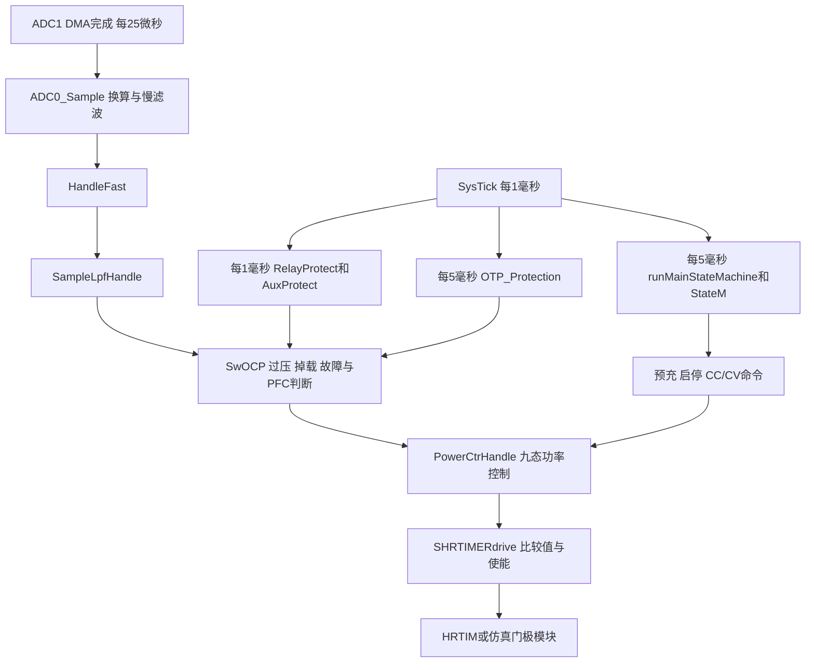
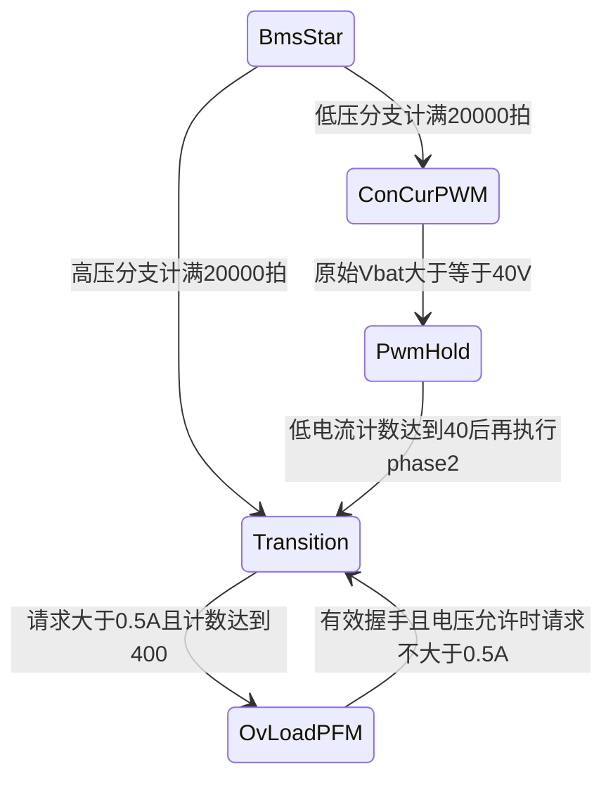

# LLC 功率控制 DLL 移植分析与设计

版本：V1.0 · 日期：2026-09-09 · 交付阶段：源码分析与设计，尚未实现 DLL 或修改模型。

## 1. 结论与建议

目标是将真实固件的 LLC 功率控制移植为 Windows DLL，接入 `LLC1600_PWM - DLL.plecs`。必须覆盖采样处理、启动与预充、PWM 恒压/恒流、PWM→PFM 过渡、PFM 电流环、同步整流、保护与继电器/放电控制。只搬一个 PI 或只输出一个 duty，不能复现这套固件。

**建议最终采用两个控制 DLL，加一个独立门极调制模块：**

| 组成 | 职责 | 执行周期 | 建议形态 |
|---|---|---|---|
| LLC_Fast.dll | 采样滤波、快保护、9 态功率状态机、参考限幅与缓变、PWM/PFM 环路、SR 策略、比较值计算 | 25 μs / 40 kHz | 必选 DLL |
| LLC_Slow.dll | 业务状态机、握手/CC/CV 请求、上电许可、继电器成熟计时、慢保护、启动/停机命令 | 1 ms 基准，内部 5 ms 和 100 ms 分频 | 建议 DLL |
| LLC_Gate | 将周期计数和 C/D 比较值转换成四路门极，并处理周期边界更新、异步封锁 | 开关边沿事件级 | 首选 PLECS C-Script/子系统；要求全部 DLL 时可用第三个 DLL |

实施时先使用**一个 DLL 内部调度快慢任务**建立对照基线，再用同一套核心函数拆成两个 DLL。这样可以先验证算法，再验证跨 DLL 数据交换造成的时序影响；最终模块划分不需要改变。

| 可选方案 | 优点 | 代价 / 适用阶段 |
|---|---|---|
| 一个控制DLL + Gate子系统 | 状态共享简单，调用顺序可控，容易对照固件 | 快慢环不能分别替换；适合先建立基线 |
| 两个控制DLL + Gate子系统 | 快慢环接口清晰，可单独调试/替换；门极按事件求解 | 需要命令事务、速率转换和单一写入者；推荐最终结构 |
| 三个DLL，第三个专做门极 | 全部核心功能封装成DLL | 固定细步长门极回调成本高；只在确实要求全部DLL时选择 |

当前最大的完整移植障碍是 `AppUser/R02_LLC_APP_V1.lib` 中的 `sr_handle.o`：`mComputer()`、`mathTimeHandle()`、`Sr_compute()` 及其查表数据没有随 C 源码提供。该库中的函数在 map 中标为 ARM Thumb 代码，不能直接链接到 Windows x64 DLL。需要原始实现，或按明确算法重新实现并另行验证。

另外：

- `DriverPwm.Plv`、`Ctrl_interFace.flvOut` 实际是 **Hz 频率指令**，不是周期计数。驱动层使用 `680000000 / Plv` 求周期。
- 当前可见代码实现了 PWM→PFM 的明确过渡，但**未实现对称的 PFM→PWM 自动返回**。
- 1600 W 是 PFM 功率限制中的一个上限；当前还有 `CON_CURR_OUT=16 A`，60 V 时电流上限对应 960 W，不能据项目名称认定现有配置已经覆盖 1600 W 工作点。
- 最终 PLECS 文件中的 DLL 目前是占位块：文件名为空、采样时间为 0，Mux/Demux 宽度均为 3，未接入实际反馈与驱动链。

## 2. 分析基线与证据约定

以下缩写用于源码位置，完整路径见文末索引。行号对应本次读取的文件。

| 标识 | 文件/目录 | 本次用途 |
|---|---|---|
| FW | `R02_LLC_APP_V1.1.1_0824` | 真实控制代码，以实际语句为准 |
| MATH | `FW/AppUser/mathR02.c` 与 `.h` | 功率状态机、PWM/PFM、PI、滤波 |
| FAST | `FW/AppUser/ConsoleFast.c` | ADC 后的快环入口与快保护 |
| SLOW | `FW/AppUser/ConsoleSlow.c` | 慢任务、预充发起、驱动比较值计算 |
| STATE | `FW/AppUser/operateStatus.c` | 业务状态机 |
| SAMPLE | `FW/AppUser/user_sample.c` | ADC 换算、慢滤波 |
| PROTECT | `FW/AppUser/ProtectionLLC.c` | 保护与上电/继电器时序 |
| HW | `FW/AppUser/HwConfig.h` | 数据结构、硬件宏与参数 |
| MAIN / IRQ / MSP | `FW/Core/Src/main.c` / `stm32g4xx_it.c` / `stm32g4xx_hal_msp.c` | 调度、HRTIM 配置、故障、引脚映射 |
| MODEL | `dll_block/LLC1600_PWM - DLL.plecs` | 本次目标模型 |
| REF | `dll_block/Visual studio projects/pi_controller` | Windows DLL 工程参考，不作为 LLC 算法 |
| MAP | `FW/MDK-ARM/XpLLC474_v0.1/XpLLC474_v0.map` | 辅助确定 ARM 库依赖；不证明现有源文件与旧固件逐字一致 |

本报告区分三类信息：**源码事实**、**建议设计**和**需补齐/验证**。目录里已有的时序、保护、架构整改笔记仅作线索；与源代码矛盾时，以源代码为准。本次没有执行固件构建、DLL 构建或 PLECS 仿真，不宣称闭环性能已经验证。

本次读取的11个关键源码/库/模型文件已记录在[源码基线SHA256清单](<D:/Work/1600W/代码分析/docs/LLC移植分析_源码基线_SHA256.json>)，便于后续确认实现依据是否发生变化。

## 3. 最终 PLECS 模型现在具备什么

### 3.1 现有电路与参数

从模型文本读取到：

| 项目 | 现值 | 对接影响 |
|---|---|---|
| 文件版本 | PLECS 4.9 | DLL ABI 应与实际安装版本头文件核对 |
| 求解器 / 最大步长 | radau / 100 ns | 这是电路求解配置，不是快环采样周期 |
| 仿真时长 | 0.2 s | 不足以观察完整固件启动、预充后等待、电流爬坡与保护恢复 |
| 初始化变量 | `fsw=200e3`, `dt=150e-9`, `td=100e-9`, `inV=350` | 部分只是初值/参数，不能当作实际运行频率或控制延迟 |
| 输入电源 V_dc2 | 380 V | 与 `inV=350` 的电容初值不一致，需要明确是有意瞬态还是统一初值 |
| 电池等效 V_dc3 / R16 | 32 V / 0.06 Ω | 电池支路需要加入受控继电器，不能始终直连 |
| 谐振电感 L14 / 电容 C24 | 20 μH / 164 nF | 由二者估算串联谐振频率约 87.9 kHz，仅为线性参数估算 |
| 励磁电感 L7 / 变压器 Tr3 | 100 μH / `[18 4 4]` | 保留作为初始电路基线 |
| 现有载波 LEAD7 | 固定 150 kHz | 不随 `fsw=200e3` 自动改变，也不能承担完整 PFM |
| Constant2→RE1→DT | 常数 0.1 与三角波比较，再产生 DRVH/DRVL | 是目前原边门极来源，非真实固件的双窗口 PWM |

依据：MODEL 1–37、63–94、543–568、697–708、977–1043、1047–1061、1144–1157、1411–1449。

### 3.2 DLL 接口尚未闭合

MODEL 1424–1479 中，DLL 的 `Filename=""`、`SampleTime="0"`、`OutputDelay="0"`、`Parameters="[]"`。当前只有 `Mux→DLL→Demux` 两段连线；未发现该 Mux 的外部输入连线，也未发现该 Demux 输出接入门极。

`dll_block/main.c` 的输入/输出/状态/参数数量全部为 0。REF 中 `main.c` 是单输入、单输出、一个状态的 PI 教程，不能直接代替 LLC 控制。

### 3.3 接线要求

| 信号 | 模型接入建议 | 注意事项 |
|---|---|---|
| Vrelay | LLC 输出滤波后、受控继电器前的独立电压测量 | 预充比较依赖它与 Vbat 的差值 |
| Vbat | 继电器后、电池端电压测量 | 不可简单与 Vrelay 共用一个信号 |
| Ibat | 电池支路电流，优先利用/核对 Am7 | 先核对正方向，使充电为正 |
| 谐振电流 | Am4，可作为谐振过流判据的模型输入 | 与 Ibat 是不同保护对象 |
| 原边高侧 | `gate_TC2` → FETD22 的控制端 | 现有 DT.DRVH 连接到 FETD22，可沿此替换 |
| 原边低侧 | `gate_TC1` → FETD21 的控制端 | 现有 DT.DRVL 连接到 FETD21，可沿此替换 |
| 两路 SR | `gate_TD1/TD2` → FETD23/FETD24 | 接线文本未见其门极驱动；TD1/TD2 与绕组极性对应须用低功率波形确认，不按名字猜测 |
| relay_cmd | 新增电池串联受控开关 | 配接触电阻与可选机械延时；定义两端采样节点 |
| discharge_cmd | 新增继电器前受控泄放电阻支路 | 现有 R24/C16 为测量/滤波支路，不能视为受控放电 |
| pfc_ok / VacRms | 仿真输入信号或场景参数 | VacRms 不能拿 380 V 直流母线代替 |
| LLC_en | 对应外部使能/许可逻辑输出 | 固件中与 DrvH/DrvL 不等价，PFC 不就绪时也可能为 1 |

原边引脚依据：MSP 662–666 中 PB12=TC1、PB13=TC2；HW 的 `DrvL` 控制 PB12，`DrvH` 控制 PB13。因此**TC1 对应低侧，TC2 对应高侧**。

## 4. 真实控制调用链与时基



| 任务 | 源码依据 | 应移植的实际周期 |
|---|---|---|
| 快环 | MAIN TIM3 PSC=16、ARR=249；ADC1 触发源 T3_TRGO；IRQ DMA 完成调用 `interrupt_ADC1`；SLOW 163–167 | 170 MHz /17/250 = 40 kHz，即 25 μs |
| 慢基准 | IRQ `SysTick_Handler→HAL_IncTick`；SLOW 12–57 | 1 ms |
| 业务状态机 | `delay_Slow>=5` 后执行 `runMainStateMachine(); StateM();` | 5 ms，保持先业务状态、后功率慢状态的顺序 |
| 继电器/辅助电源保护 | `HAL_IncTick` 尾部 | 1 ms |
| `OTP_Protection` | `delay_Slow==1` 分支 | **5 ms，不是 1 ms** |
| `SysReset` | `delay_Slow==3` 分支内计 20 次 | 100 ms |
| 温度等 ADC2 | ADC2 独立触发链 | 完整 ADC 模拟时单独核对；首版用降额等级注入，不影响 25 μs 功率采样基准 |

当前 PWM/PFM 的 Ki 都是按调用拍数使用的离散系数。不要再像 PI 教程那样额外乘 `Ts`。若改变快环周期，PI、IIR 系数、缓变斜率和所有拍计数必须一起重新设计。

## 5. 需要覆盖的 9 个快环状态

模式数值来自 MATH.h 的枚举顺序，DLL 调试输出建议保持一致。

| 值 / 状态 | 主函数 | 控制内容 | 频率与占空比/退出 |
|---|---|---|---|
| 0 NoSelect | `ConIdleHandle` | 关波，复位 PFM PI 和进环滤波，清预充/时间 | DrvH/L/SR=0；Plv=250 kHz，Duty=0.02 只是待命指令 |
| 1 SoftStar | `SoftStart` | 无握手唤醒预充 | 120 kHz；Vrelay 台阶 Duty=0.035/0.04/0.044/0.047/0.05；到 30 V 合继电器，随后关波等待 >1000 拍再请求 ConVolt |
| 2 BmsStar | `SoftCurStart` | 有握手 CC 预充、电压对齐、合继电器 | 预充 40 kHz；之后按 Vbat 分流至 ConCurPWM 或 Transition |
| 3 SoftCurSt | `ConVoltCurHandle` | PMS CV 预充，完成后在同一状态调用 `ConVoltHandleTwo` | 40 kHz；此模式既包含预充，又包含运行，不存在独立的 CV2 枚举 |
| 4 ConVolt | `ConVoltHandle` | 30 V 唤醒恒压，叠加 5.4 A 限流 | 120 kHz；Duty 上限 0.4；小于 0.02 关高侧；放电开启 |
| 5 ConCurPWM | `ConCurrHandle` | PWM 恒流，参考最大 10 A | 80 kHz；误差限 ±0.2 A；Duty 0.02–0.4；Vbat≥40 V 请求 PwmHold |
| 6 Transition | `ConTransHandle` | 从窄脉冲过渡到 PFM | 250 kHz；请求>0.5 A 时进行 400 拍斜坡，末拍切 OvLoadPFM |
| 7 OvLoadPFM | `ConPfmHandle` | 调频电流环与 SR | 60–250 kHz；Duty 指令 0.5；实际原边宽度由比较值扣边沿留白 |
| 8 PwmHold | `ConPwmHoldHandle` | PWM→PFM 前降占空比/等待电流 | phase1=80 kHz、Duty=0.04、DrvH=0/DrvL=1；phase2 请求 Transition，250 kHz、Duty=0.05 |

### 5.1 有握手 CC 预充的完整条件

慢环 `ChargeOn()` 启动 CC 需：进入充电或切入有效 CC/CV 模式、无 `OvFault`、Ibat_FIR<1 A、Vrelay<Vbat−2 V、请求电压≥30 V、29 V≤Vbat<60 V，相关计数达到 40 次 5 ms。成立后清启动状态，进入 BmsStar。（SLOW 272–354）

`SoftCurStart()` 内部：

1. `preOK=0,litate=0`：40 kHz 开环抬压，Duty 按 Vrelay 取 0.01/0.02/0.03/0.04/0.06/0.07，Vrelay>Vbat 时覆盖为 0.05；到 Vbat+2 V 后进入下一子阶段。
2. `litate=1`：关波并放电；若 Vrelay<Vbat+0.5 V 退回抬压，否则计满 20 拍，进入 `preOK=1`。
3. `preOK=1`：Vrelay<Vbat+0.2 V 时计 20 拍后合继电器，进入 `preOK=2`。不满足时源码未显式清该计数，不能统一改成连续计时。
4. 继电器已合后，低压分支计 20000 拍进入 ConCurPWM；高压分支计 20000 拍进入 Transition。Vbat<40 V 与 ≥40 V 分别计数；清零边界为 >40.5 V 和 <39.5 V，包含保留计数的滞回区。

20000 拍对应 500 ms。Vrelay 和 Vbat 若在模型中始终等同，会让上述流程无法按真实设计运行。

### 5.2 PWM→PFM 的实际链路



需要保留的细节：

- PwmHold 检查 `iOut_Bat_FIR<1 A`，不是快 LPF，也不是原始 Ibat。
- 不满足低电流条件时没有 `else time=0`，因此当前代码是累计满足 40 次，不能写成严格连续 1 ms。
- `ConPwmHoldHandle` 的 phase2 在下一次快环调用才执行。
- Transition 的正常斜坡为 `time*0.001+0.05`。到 400 拍时先清 time、请求 PFM，再输出 Duty=0.05。
- `PowerCtrHandle` 在末尾立即更新 CtrMode，随后同拍 `SHRTIMERdrive` 已选择 PFM 分支；因此边界拍实际是 PFM 比较窗口，不能只看 Duty=0.05 推断波形。
- PFM 中若握手为 0 或原始 Vbat<39 V，清参考、关波、复位 PFM 积分预置，**模式仍为 OvLoadPFM**。上层逻辑可能再改变模式，但不存在此处分支直接 RequestMode(ConCurPWM)。

若目标包含自动 PFM→PWM，应作为新增行为：定义下降阈值/保持时间、关 SR/降功率、原边封锁/周期提交、PWM PI 预置与重启，并单独验证。首版应先把现有单向切换复现清楚。

### 5.3 PMS CV 与 CC 的含义

外部 `PMS_CVModeReq=0` 表示 CC 请求，1 表示 CV 请求；内部 `xp_CVmode` 则是 0=关闭/无有效模式、1=CC、2=CV。BMS 握手时 `ChargeOn()` 强制内部模式为 1。

`ConVoltHandleTwo()` 读取 PMS 电压请求，范围 30–60 V，电压误差钳在 [−0.9,0.01]，采用增量 PI，并按电流/电压计算动态占空比上限，再经 `limRef=0.95*limRef+0.05*limit` 平滑。Duty<0.007 时关闭高侧。（MATH 665–710）

注意 `Charging_state_Function` 有直接针对 CAN 原始数值的比较，后续快环才乘 0.1；移植时要先明确原始字段单位，不能对所有函数统一套一次或两次缩放。

当前 `Burst` 字段和报文位不代表已经具备可运行的 Burst 控制；可见快环没有 Burst 模式状态与脉冲包调度。若需要 Burst，必须新增规范和实现，不列作可直接移植内容。

## 6. 环路、限幅与采样如何移植

### 6.1 采样保留三条用途不同的通路

| 通路 | 原函数/公式 | 用途 |
|---|---|---|
| 原始物理量 | `ADC0_Sample`：ADC码×COM_VOUT_BASE/COM_IOUT_BASE | 快保护、部分模式阈值、SR 启停条件 |
| 慢平滑量 `*_FIR` | y=0.999y+0.001x，每25 μs | 模式切换、电流是否归零、功率 P/V 限幅、上报；这是递归一阶滤波，名称虽为 FIR |
| 快 LPF `*_LPF` | `SampleLpfHandle→OneOrderForm`，B0=B1=0.2391，A1=−0.5219 | 电压/电流闭环反馈 |

首版 DLL 输入直接用 V、A，替代 ADC 硬件换算，保留后续两种滤波。在 ADC 量化对照模式下再加 12 bit 量化/饱和：V 满量程 69.3 V，I 满量程 66 A。不要把模型中的 V/A 再乘一次 ADC 比例系数。

全部滤波器历史量需要放进实例状态，并统一在仿真开始复位。`ConIdleHandle→PowerIniPidVar` 会反复复位三路快 LPF；这是当前行为，应记录它对启动第一拍的影响，不能无记录地改成持续滤波。

### 6.2 PWM 和 PFM 的 PI 必须保持区别

PWM 增量核：

```text
delta_u[k] = Kp*(e[k]-e[k-1]) + Ki*e[k]
u[k]       = u[k-1] + delta_u[k]   // 由调用方完成累加和限幅
```

`pi_str.integral` 在 PWM 中保存上一拍误差。`oldout` 才是累计输出。30 V 恒压模式对电压环与限流环的增量输出先取小，再加到共同的旧占空比上；并非把两个完整独立 PI 的绝对输出取小。

PFM 位置式核：

```text
integral[k] = integral[k-1] + Ki*e[k]
y[k]        = integral[k] + Kp*e[k]
freq_hz[k]  = clamp(y[k]*50000, 60000, 250000)
e[k]        = Ibat_LPF - Curr_REF
```

PFM 误差符号与 PWM 恒流相反。限到上下界时，源码将积分项预置为对应 `freq_hz/50000`。`mComputer()` 在计算前被调用，与增益更新相关的确切公式需要库源码确认；不能默认 PFM 使用 PWM 的 Kp/Ki，也不能将其留为 0 后声称闭环正常。

### 6.3 参考限幅与功率限制

PWM：`CurrentMax` 从当前 BMS/PMS 请求获取，钳至 10 A，参考以 0.0002 A/拍逼近。

源码的缓变门控并不是严格的 `abs(Curr_REF-Ibat)<1 A`：上升分支仅检查 `Curr_REF>Ibat_LPF-1`；下降分支仅检查 `Curr_REF<Ibat_LPF+1`。文档或注释中的“±1 A 窗”不能取代这两个具体判断。（MATH 91–113）

PFM：

```text
P_limit = min(VacRmsFir*7.2, 1600)               // W，VacRmsFir 单位 V
I_limit = min(I_request, P_limit/Vbat_FIR, 16)   // A，Vbat_FIR>0.01 时应用 P/V
I_limit *= OTP倍率                             // level1=0.75，level2=0.5
Curr_REF = RampToward(Curr_REF, I_limit, 0.0002)
```

8 A/s 是未被 PWM 门控限制时的参考变化速度。PFM 的 16 A 比 1600 W 上限更早约束 30–60 V 范围内的多数工作点，例如 50 V、16 A 对应 800 W。若未来要验证 50 V/1600 W，则目标电流为 32 A，需要同时审视电流上限、保护、磁件/器件、采样与 SR 查表范围；不只是把一个功率常数改成 1600。

这套代码是 CC/CV 控制附带功率限幅，没有发现独立的“功率误差 PI”。如果需要直接给定 P_ref 的恒功率模式，可以以后增加 `I_ref=P_ref/max(Vbat,Vmin)` 的外层请求变换及限幅，但应明确它是新增能力。

## 7. 函数级移植清单

### 7.1 必须迁移的快环与数学函数

下列目标文件名属于建议的新工程结构，不代表已经创建实现。

| 原函数 / 位置 | 处理 | 建议归属 | 关键依赖/改造 |
|---|---|---|---|
| `interrupt_ADC1`，SLOW:163 | 改为仿真调度入口 | llc_fast_task.c | 去掉 ADC 中断依赖，顺序保留 |
| `ADC0_Sample`，SAMPLE:105 | 提取物理量接收与 FIR | llc_sample.c | ADC码换算做可选适配层 |
| `SampleLpfHandle`，MATH:30 | 保留算法 | llc_sample.c | static ini 和滤波状态实例化 |
| `HandleFast`，FAST:5 | 提取流程 | llc_fast_task.c | GPIO读取→输入；故障/继电器动作→状态与输出 |
| `SwOCP`，FAST:95 | 保留当前有效保护 | llc_protection_fast.c | RelayOld、原始电压/电流 |
| `PowerCtrHandle`，MATH:304 | 保留9态与末尾采纳请求顺序 | llc_power_fsm.c | CtrMode/reqMode，仅快环持有 |
| `RequestMode`，MATH:17 | 保留，补接口参数合法性检查 | llc_power_fsm.c | DLL 输入先验证枚举上下界 |
| `ConIdleHandle`，MATH:172 | 保留输出/复位语义 | llc_power_fsm.c | PFC、故障、放电/继电器状态 |
| `SoftStart`，MATH:424 | 保留 | llc_startup.c | preNum、starTime、Vrelay_LPF |
| `SoftCurStart`，MATH:555 | 保留 | llc_startup.c | 两个预充计数、litate/preOK |
| `ConVoltCurHandle`，MATH:713 | 保留 | llc_startup.c | delay、CV电压请求、继电器 |
| `ConVoltHandle`，MATH:473 | 保留 | llc_pwm_control.c | PWM电压PI和限流PI |
| `ConVoltHandleTwo`，MATH:665 | 保留，并补目标工程头文件声明 | llc_pwm_control.c | limRef、PMS电压请求、CV模式 |
| `ConCurrHandle`，MATH:495 | 保留 | llc_pwm_control.c | CurrentMax、Curr_REF、iParamPid |
| `ConPwmHoldHandle`，MATH:188 | 保留 | llc_transition.c | holdPhase、累计time、Ibat_FIR |
| `ConTransHandle`，MATH:218 | 保留 | llc_transition.c | 边界拍先切模式后计算驱动 |
| `ConPfmHandle`，MATH:247 | 保留，补库依赖后闭环 | llc_pfm_control.c | mComputer、mathTimeHandle |
| `RefRampPwmCurr`，MATH:91 | 保留独立策略 | llc_reference.c | 10A上限与原始单边门控 |
| `RefRampPfmCurr`，MATH:119 | 保留独立策略 | llc_reference.c | AC RMS、P/V、16A、OTP |
| `UpdateCurrentMaxFromCan`，MATH:65 | 改为读取标准命令输入 | llc_reference.c | 不引入 CAN 驱动/协议栈 |
| `RampToward`，MATH:80 | 直接迁移纯函数 | llc_math.c | 保留float和step含义 |
| `PiPwmCompute`，MATH:380 | 直接迁移 | llc_math.c | 返回增量 |
| `Compensator_Pid`，MATH:370 | 直接迁移 | llc_math.c | 返回绝对控制量 |
| `OneOrderForm`，MATH:396 | 直接迁移 | llc_math.c | 一阶状态，不重复滤波 |
| `PowerIniPidVar`，MATH:352 | 按调用场景拆复位接口 | llc_reset.c | 当前只清PFM PI及滤波，不等于完整实例复位 |
| `DriveSet`，MATH:48 | 保留指令写入与钳位 | llc_drive_command.c | 输出频率Hz、Duty、三路使能 |
| `PwmSyncDrvUpdate`，MATH:149 | 保留并纳入行为对照 | llc_sr.c | static delaySr、SynDrv历史值 |
| `SHRTIMERdrive`，SLOW:458 | 拆成纯计算与硬件应用 | llc_timer_image.c | 保留有效版本458–575；寄存器写入改成输出数组 |

`SecondOrderForm`、`oneOrderForm`、`piExter_Compute` 可随数学模块保留以支持验证，但应以实际调用决定是否参与运行。`JudgeMode`、`powerConver`、`A_SR_Control` 等在可见主链中没有有效调用，不因头文件声明就纳入必需运行链。

### 7.2 慢环需要迁移的内容

| 原函数 | 建议处理 | 模块 |
|---|---|---|
| `HAL_IncTick` | 提取1ms时间基准和1/5/100ms调度；不保留HAL覆盖函数名 | llc_slow_task.c |
| `SysStatesInit`, `runMainStateMachine` | 保留业务状态逻辑；保持RunState与SysSta同步门槛 | llc_app_fsm.c |
| `get_CAN_States` | 从仿真命令适配器读取握手、online、使能、CV请求和故障 | llc_command_adapter.c |
| 6组 `*_state_Function` / `*_state_Switch` | 保留Init/Wakeup/Standby/Charging/FullCharged/Fault | llc_app_fsm.c |
| `StateM`, `StateMInit`, `ConVoWakeup`, `StandBy` | 保留业务到功率状态的动作，转为一次性命令事务 | llc_supervisor.c |
| `ChargeOn`, `ChargeFull`, `StateMErr` | 保留启动判据、CC/CV切换、停机恢复 | llc_supervisor.c |
| `starLowIni`, `PwmClose` | 转为初始化/关波动作请求 | llc_supervisor.c / llc_reset.c |
| `RelayOn/Off`, `DischargeOn/Off`, `LLC_Enable/Disable` | 去GPIO，保留逻辑状态与门控输出 | llc_actuator.c，快环最终执行 |
| `RelayProtect`, `AuxProtect`, `Protect_comm` | 按现有1ms调用迁移有效保护 | llc_protection_slow.c |
| `OTP_Protection` | 当前有效部分是RelayOld计时和风扇固定输出；迁移RelayOld计时，风扇不参与功率环 | llc_protection_slow.c |
| `SysReset` | 保留AC电压许可、iniOk、延时/故障复位语义；启动HRTIM改为timer_running信号 | llc_startup_permission.c |
| `HwProtectIni` | 新工程按每个实际状态类型完整复位 | llc_reset.c |

`LEDShow`、CAN/UART报文打包、Flash、OTA、Bootloader、看门狗、SPI、MCU系统时钟初始化不编译进入控制DLL。与它们相关的输入，如PFC RMS、握手、通信丢失和停机请求，以可控仿真信号替代。

### 7.3 缺失库功能的明确清单

| 缺失项 | 已确认的证据 | 需要取得的内容 |
|---|---|---|
| `mComputer()` | MATH:264调用；MAP:1356指向sr_handle.o；读取DriverPwm、采样、系数表并引用piStructInter | 算法源码、Kp/Ki生成规则、输入范围和限幅 |
| `mathTimeHandle()` | MATH:278调用；MAP:1867显示进一步调用Sr_compute | SR许可、时间参数更新、返回值含义及内部状态 |
| `Sr_compute()` | MAP:4586来自R02_LLC_APP_V1.lib | SR提前/延迟/脉宽计算 |
| `M_CoeffiFX/Fp/Fi` | MAP:4106–4108，均14项float | 数值、轴定义、插值/外推规则 |
| `M_highPlv/M_lowPlv/M_ArHigh/M_Arloplv/M_ArLow` | MAP:4101–4105 | 数据布局、索引、物理单位与有效区间 |
| 其他头文件声明表 | MATH.h中的FR/FB等 | 仅在恢复源码实际引用时纳入，不能由名字猜用途 |

优先获取原始 `sr_handle.c/.h` 及关联参数文件，再以MSVC重编译。若暂时拿不到，可先做 PWM、预充、慢状态机和门极验证；PFM采用显式标记的独立实验参数/SR禁用方案，仅验证接入能力，不能标记为真实算法复现。禁止用空函数补链接后交付“全模式完成”。

## 8. DLL 内部模块和状态所有权

### 8.1 建议工程结构

```text
LLC_Plecs_Port/
  include/      llc_types.h, llc_params.h, llc_ports.h, llc_context.h
  core/         llc_math.c, llc_sample.c, llc_reference.c
                llc_power_fsm.c, llc_startup.c, llc_pwm_control.c
                llc_transition.c, llc_pfm_control.c, llc_sr.c
                llc_timer_image.c, llc_actuator.c, llc_reset.c
  supervisor/   llc_app_fsm.c, llc_supervisor.c, llc_slow_task.c
                llc_protection_slow.c, llc_startup_permission.c
  fast/         llc_fast_task.c, llc_protection_fast.c
  adapters/     llc_command_adapter.c, llc_plecs_fast.c
                llc_plecs_slow.c, llc_plecs_combined.c
  third_party/  当前安装PLECS的DllHeader.h
  model/        LLC1600_PWM_DLL_Port.plecs, LLC_Gate子系统
  tests/        逐拍输入回放、比较值用例、模式切换用例
```

硬件平台层不应该通过在PC上定义一套假的 `GPIOB/HRTIM/TIM` 寄存器来掩盖依赖。直接把物理采样、执行器命令和定时器事件数据作为平台边界，算法仍使用清晰的纯C结构。

### 8.2 单一写入者

| 状态 | 所有者 | 跨模块传递方式 |
|---|---|---|
| CtrMode、reqMode、preOK、litate、holdPhase、Curr_REF、PI/滤波状态 | Fast | 输出只读状态快照；Slow发送动作请求 |
| DriverPwm、SR历史、比较值、最终继电器/放电/LLC使能命令 | Fast | 输出定时器图像和执行器状态 |
| SysSta、RunState策略、OldState、上电/慢计数、CC/CV业务选择 | Slow | 命令序号+动作掩码+参数 |
| 快故障与OvFault | Fast | 输出故障源位；Slow可请求复位但不直接写内存 |
| 慢故障、RelayOld、timer_running | Slow | 保持型状态信号 |
| 当前周期的实际门极/相位、待提交比较值 | Gate | 快环不直接改变正在执行的半个周期 |

不要让两个DLL各自定义同名全局 `Ctrl_interFace/DriverPwm` 后期待它们共享，也不要把指针转成double通过PLECS信号传递。通过显式输入输出交换数据。

### 8.3 跨DLL命令事务

慢函数原来可能同时修改模式、PI初值、preOK、litate、Curr_REF、继电器和放电状态；移植时必须把整组动作作为事务传递，不能只传 `CtrMode`。

建议命令包含：`command_seq`、`mode_request`、`init_flags`、`voltage_request`、`current_request`、`gpio_action_mask` 和对应目标值。Fast仅在序号改变时采纳一次，随后输出ack。参考电流/电压等持续命令仍可每拍读取。

`init_flags` 必须区分：清Curr_REF、清preOK/litate、清hold/time、清PWM电压PI、清PWM电流PI、清PFM PI/LPF、按原逻辑设置oldout、请求故障复位。不要统一成“每次命令把所有状态清零”。

继电器/放电动作也是一次性事件；若慢环把“RelayOff”作为每拍强制覆盖，就会把快环预充完成的 `RelayOn` 反复撤销。

## 9. 建议接口表

以下是用于详细设计的 **V1端口合同草案**，采用标准V/A/Hz/计数单位；后续实现冻结在 `llc_ports.h`，由它统一生成端口说明。每个DLL的numInputs/numOutputs必须与实际版本一致。

### 9.1 LLC_Fast.dll 输入，22维

| 索引 | 名称 | 单位/含义 |
|---|---|---|
| 0–2 | v_relay, v_bat, i_bat | V、V、A，未经DLL滤波 |
| 3 | pfc_ok | 0/1 |
| 4 | hw_fault_bits | 硬件故障注入位图；原始封锁同时直送Gate |
| 5 | vac_rms_fir | V，PFM功率限制使用 |
| 6 | otp_level | 0/1/2；首版外部注入，默认0 |
| 7 | command_seq | 非负整数，模式/一次性动作事务编号 |
| 8 | mode_request | −1=无模式变更；0–8=有效状态请求 |
| 9 | init_flags | 初始化动作位图 |
| 10–11 | i_request, v_request | A、V，已经标准化，核心内不再乘0.1 |
| 12 | handshake | 0=无；1=BMS；2=PMS |
| 13 | cc_cv_mode | 0=无有效模式；1=CC；2=CV |
| 14 | run_state | 业务功率状态 |
| 15 | relay_old | 继电器成熟许可 |
| 16 | slow_fault_bits | 慢保护当前有效故障源 |
| 17 | reset | 实例复位测试输入；按上升沿处理 |
| 18 | gpio_action_mask | 此事务需要执行哪些执行器动作 |
| 19–21 | relay_cmd, discharge_cmd, llc_enable_cmd | 仅对应mask置位且事务被采纳时执行 |

### 9.2 LLC_Fast.dll 输出，28维

| 索引 | 名称 | 含义 |
|---|---|---|
| 0 | period_ticks | 量化后的周期pre |
| 1–4 | C_cmp1..C_cmp4 | 原边四比较事件计数 |
| 5–8 | D_cmp1..D_cmp4 | SR四比较事件计数 |
| 9–11 | drv_h, drv_l, sr_enable | 控制许可，不能解释为即时门极电平 |
| 12–14 | llc_enable, relay, discharge | 最终执行器逻辑状态 |
| 15–16 | mode, pre_ok | 快环状态与预充阶段 |
| 17–18 | current_ref, current_limit | A |
| 19–20 | frequency_cmd, duty_cmd | Hz、比例，便于算法观察 |
| 21–22 | v_bat_fir, i_bat_fir | V、A，供慢环/观测 |
| 23–24 | fast_fault_bits, ov_fault | 快故障与特殊过压闭锁 |
| 25–27 | command_ack, fast_tick, diagnostic_bits | 事务/执行计数/参数与窗口诊断 |

Gate 使用0–11，并从Slow接收timer_running、从模型接收原始硬件故障封锁。DLL输出的频率、Duty供调试，Gate以完整比较值为准，避免重新推导出与固件不同的波形。

### 9.3 LLC_Slow.dll 输入，20维；输出，17维

| 方向 / 索引 | 名称 |
|---|---|
| In 0–2 | v_relay, v_bat, i_bat |
| In 3–4 | v_bat_fir, i_bat_fir |
| In 5–9 | relay_applied, fast_mode, pre_ok, ov_fault, fast_fault_bits |
| In 10–12 | pfc_ok, vac_rms, aux_voltage |
| In 13–18 | handshake_raw, online, charge_enable, cv_request_raw, v_request_V, i_request_A |
| In 19 | reset |
| Out 0–2 | command_seq, mode_request, init_flags |
| Out 3–6 | i_request_A, v_request_V, handshake_normalized, cc_cv_mode |
| Out 7–9 | run_state, relay_old, slow_fault_bits |
| Out 10–13 | gpio_action_mask, relay_cmd, discharge_cmd, llc_enable_cmd |
| Out 14–16 | power_on_ms, slow_tick, timer_running |

此合同按选定握手源提供一组电压/电流和有效使能，面向功率控制验证；若要逐字复现BMS/PMS同时存在且请求不同的CAN业务，需扩展成两组请求和使能，保持原始OR/online=3禁能语义。不要把首版标准命令适配器误称为完整CAN协议仿真。

PFM参数策略版本、Ts、计数频率、采样比例、实验增益/SR模式等作为parameters输入，在Start时检查。生产复现配置固定40kHz及原始参数；实验替代配置必须输出明确诊断标识。

## 10. PWM/PFM门极必须怎样生成

### 10.1 保留计数器量化

按SLOW 462–464：

```text
preA = uint16(680000000 / freq_hz)
pre  = preA & 0xfffc
half = pre/2
```

因此Plv是Hz。建议新代码变量命名为`frequency_hz`，原名仅用于对照。参数`POW_MIN_PLV=60000`对应最低频率60kHz，`POW_MAX_PLV=250000`对应最高频率250kHz；MATH.h中的“最低频/最高频”注释与实际使用相反。

量化后的实际开关频率是`680000000/pre`。示例：80kHz→8500ticks；120kHz→5664ticks，约120.056kHz；250kHz→2720ticks。模式固定频率也应保留这层量化。

### 10.2 PWM：两个独立窄脉冲窗口

设q=pre/4，b=3pre/4，w=floor(Duty*half)：

```text
TC1： [q-w, q+w)     -> 原边低侧，受DrvL控制
TC2： [b-w, b+w)     -> 原边高侧，受DrvH控制
```

每个MOS的导通宽度约为Duty×T，两个窗口相隔半周期，中间可以存在双方都关闭的区间。这不能用`low=NOT(high)`复现。

例：80kHz、Duty=0.1：pre=8500，half=4250，w=425；TC1=[1700,2550)，TC2=[5950,6800)，各自脉宽1.25μs。现有DT的互补逻辑必须整体替换，不能只把其比较器输入接成DLL的Duty。

### 10.3 PFM：固定半周期结构，频率可变

令d=LLC_DEADTIME=120ticks：

```text
TC1： [d, half-d)
TC2： [half+d, pre-d)
```

一个tick按当前680MHz计数约1.470588ns；120ticks约176.47ns。相邻原边窗口之间的总留白为240ticks，约352.94ns。源码注释“300ns”和模型dt=150ns都不能直接当成该波形的真实留白。

MAIN:897明确关闭HRTIM自动死区插入，当前PFM留白由比较值实现。Gate若已按比较值生成波形，不应再串一个相同功能的Blanking Time造成重复死区。

### 10.4 SR：同时移植计算、使能和最终边沿

PFM驱动计算：

```text
target_width = half - 2*d - Sr_Atime - Sr_Btime
Sr_Dtime     = min(0.999*Sr_Dtime + 0.001*target_width, target_width)
DrvDtime     = uint16(Sr_Dtime)
a            = d + Sr_Atime
b            = a + DrvDtime
TD1          = [half+a, half+b)
TD2          = [a,b)
```

当SynDrv=0时，固件虽然仍填入占位比较值，但GPIO最终被强制关闭。模型必须输出低电平，不能让这些窄占位脉冲真实驱动MOS。

PWM的SR只在ConCurPWM/PwmHold且SynDrv与DrvH允许时使用。Sr_Atime固定200ticks；宽度相关条件小于150ticks时关闭SR。有效比较窗口为：

```text
TD1 = [3pre/4-w+Sr_Atime, 3pre/4+w)
TD2 = [ pre/4-w+Sr_Atime, pre/4-w+Sr_Atime+DrvDtime)
```

**当前两路PWM SR结束时间并不对称**：TD1结束点直接用`bemp+duty`，TD2使用平滑后的DrvDtime。先保留原式并记录波形差异，不能按“看起来更对称”自行改写。

还要检查每个窗口的start/end是否有序、是否落在本周期内，使用有符号中间量，避免负脉宽转换为uint16后形成大脉冲。非法窗口默认关闭该路并输出诊断；这种输入域保护应与正常区间的逐值等价分开验收。

### 10.5 Gate模块形态选择

**推荐C-Script事件调度：** 模块保存活动周期/比较值和下一周期待更新值，安排周期边界及每一个比较边沿的事件。频率改变时不使用`fmod(time,new_period)`重算相位，以免在周期中间跳变。控制参数在约定的周期边界整体提交；异步故障封锁立即生效。最终与MAIN中的Master预装载、Timer C/D更新/复位事件做对照。

这是一项仿真时序设计；MCU不同寄存器写入是否跨更新边界仍需硬件/定时器回放确认，不能仅靠源代码假定所有实际写操作天然原子。

**全部使用DLL的备选：** `LLC_Gate.dll` 使用固定细步长产生边沿，起步可选10ns并与5ns结果做收敛对照；步长需要远小于最短有效脉宽/留白。该DLL仍只计算门极，不在每个10ns重复执行快/慢环。10ns意味着1秒约1亿次Gate回调，完整几秒启动会很慢，并且680MHz计数边沿仍存在量化误差。

本地DllHeader只有固定调用的输出接口，没有C-Script那样的下一事件时间接口。不能声称在25μs一次的DLL回调中“延时几百ns”就可真实产生这些门极；在函数内循环/sleep也不会推进PLECS电路求解时间。

## 11. 多速率执行与PLECS DLL包装

### 11.1 推荐调度约定

单DLL基线：25μs入口内执行一次采样和快环；每40拍安排一次1ms任务，1ms任务内部按原delay_Slow分配5ms/100ms工作。必须明确首次任务在t=0还是t=Ts，复现配置建议t=0只输出初始化状态，首个快控制拍为25μs、首个慢tick为1ms。

两个DLL：Fast=25e-6，Slow=1e-3；Slow内部仍分频执行5ms业务状态机。Fast→Slow状态通过明确的采样保持/离散延迟取得上一份完成的快环快照，Slow→Fast命令由序号在下一次快拍采纳，避免双向直接馈通形成代数环。

必须规定同一时间戳的执行顺序，不依赖组件在图上的摆放。一个可复现的约定是：Slow在1ms时读取此前已完成的Fast快照，生成命令；Fast在下一个25μs拍采纳。由此引入最多一个快拍的命令延迟，需与单DLL基线对照。硬件故障不经过该慢链延迟。

### 11.2 DLL四个导出函数

| 接口 | 包装层职责 |
|---|---|
| `plecsSetSizes` | 设置输入、输出、states、parameters四个数量 |
| `plecsStart` | 校验参数、分配/初始化实例上下文、初始化全关输出；不读取尚未定义的inputs |
| `plecsOutput` | 输入校验与采样→一次状态更新→计算输出；不得把一次控制更新重复累计成多个拍 |
| `plecsTerminate` | 释放实例资源，清理日志文件等 |

使用当前安装PLECS提供的`include/plecs/DllHeader.h`，保留ABI结构和打包方式。默认按x64构建，并在About PLECS核对位数；输出延迟应小于采样周期。初始算法对照可用0延迟，后续按实测计算时间加入延迟，不能直接把模型`td=100ns`当作MCU执行时间。接口依据见[Plexim DLL文档](https://docs.plexim.com/plecs/latest/components-by-category/dll/)。

REF工程中的全局kp/ki/ts适合单实例教程。正式移植所有可变状态都放入每个DLL块自己的Context。`userData`可存实例指针；但需要稳态求解/保存恢复可见状态时，应将算法离散状态映射到`states[]`并验证还原能力，不能假定PLECS会序列化任意userData内存。

### 11.3 所有持久状态必须可复位

最低清单包括：

- 三个pi_str、三路快LPF、慢FIR、DriverPwm所有SR时间。
- Ctrl_interFace全部字段，以及星号模式中的preNum、preChargeTime/2、delay、starTime、limRef。
- `PwmSyncDrvUpdate.delaySr`、`HandleFast.vtemp`、OvFault/OvTime。
- Slow中的CvCc、cont、MerrCnt、各业务状态、Delay1ms、UART分频计数。
- `OTP_Protection.RelayNum`、SysProtectData全部元素、SysReset许可计数。
- 库恢复后新增的PFM/SR内部历史量、Gate相位、待提交比较值、命令seq/ack。

仿真启动复位和运行中的模式切换复位是两种不同动作。必须验证同一模型连续运行两次结果一致、同一DLL加载两个实例互不干扰。

## 12. 保护应迁移到什么程度

| 层级 | 当前有效行为 | 仿真实现 |
|---|---|---|
| 模型异步硬保护 | HRTIM故障输入4/5/6；IRQ封锁门极、停机、开泄放、断继电器 | 模型比较器/故障注入直接封锁Gate，并把故障送Fast锁存 |
| 快保护 | RelayOld后Vbat<10V且Ibat>10A短路；Ibat>42A过流；Vbat≥62V过压；动态掉载/OvFault；PFC判定 | 保留FAST有效代码及同拍关波顺序 |
| 慢保护 | 每1ms执行RelayProtect、AuxProtect | 保留Protect_comm自身计数机制，不能简单替换成某个“连续超限200ms” |
| 继电器成熟许可 | OTP_Protection每5ms累计400拍 | 合继电器约2s后RelayOld=1，再启用对应保护 |
| 特殊过压恢复 | Vbat≤58V累计140000快拍 | 约3.5s；否则清OvTime |
| 系统故障恢复 | StateMErr故障清除后200个5ms拍 | 约1s |

SLOW在1900ms启动比较器，Protect_comm在powerOn达到2000ms后运行其逻辑。完整复现保留该时序；快速实验可配置初始化为已就绪，但必须作为独立实验初态记录。

不要把未启用功能当成当前固件事实：

- FAST中的`HwProtect()`调用已注释；`OutOvProtect/OutUvProtect/OutOcProtect`的存在不代表都在实际路径中运行。
- 当前OTP温度输入、分级升降及故障处理主体是注释代码；有效的`OTP_Protection`没有自动生成温度降额等级。PFM虽然读取ErrStaErr，但正常初始化为0，不能宣称温度越高就一定自动降额。
- `SysReset`在iniOk=0时会清全故障并回初始化。完整行为对照要覆盖这一来源，不能另做一个永不释放的总锁存导致无法启动。

快慢故障分别持有，最终故障按源合并。复位也要按源确认条件，避免慢DLL发回较旧的“无故障”值清除刚发生的快故障。

## 13. 已识别的移植风险与处理原则

| 问题 | 源码事实 | 本次建议 |
|---|---|---|
| Plv单位/上下限注释反转 | 680MHz/Plv计算周期 | 新接口统一Hz；复现公式不改 |
| PFM自动返回PWM缺失 | Vbat<39V只是关波 | 作为后续新增切换，不假装原来已有 |
| 模式与波形同拍更新 | reqMode末尾采纳，随后驱动选择新模式 | 显式输出实际波形模式/比较值；验收Transition最后一拍 |
| 计数不全是连续保持 | Hold等多处条件失败不清计数 | 逐处分辨累计、滞回、连续计数 |
| SR启停与SynDrv复写 | ConCurr/ConPwmHold多处DriveSet先写SynDrv=0，再PwmSyncDrvUpdate | 不能仅按辅助函数注释认定运行中一定保持“4A开/2A关”滞回；逐拍记录真实行为 |
| PWM SR结束时间不对称 | TD1固定结束，TD2使用DrvDtime | 先复现，是否调整作为独立变更 |
| PI低端累计可能继续下降 | CV部分oldout未统一做下限饱和，DriveSet只钳最终Duty | 先记录内部状态与输出差异；改善anti-windup另行评估 |
| 空闲反复清LPF | PowerIniPidVar每次NoSelect都调用 | 不悄悄变为连续滤波 |
| 初始化sizeof对象不一致 | PROTECT:220用sizeof(TSysProPara)清SysProtectData元素 | 移植按实际TSysProData/整个数组大小清零；核对原结构尺寸和影响 |
| 无效浮点/极端频率 | DriveSet简单比较不能拦截NaN；后续频率转uint16 | DLL边界校验isfinite及有效范围；非法指令关波并诊断 |
| 参数宏与实际控制不一致 | PWM_MAX_DUTY=0.15未被环路采用；实际有0.4 | 抽取实际使用值，不批量套历史宏 |
| 功率/额定名称与电流限幅不同 | PFM受16A限制，PWM受10A限制 | 报告真实运行包络；更高功率需要明确调参项目 |
| 慢状态故障摘要不含全部故障位 | get_CAN_States摘取部分FaultSta位 | Fast仍按FaultSta.all停机，移植不能只传Chrgr_FaultInfo一个布尔量 |
| 请求归零语义不是统一停机 | CV函数、CC模式、慢模式选择各有自己的分支 | 分别测停止、模式0、掉握手和CurrentMax门槛，不擅自合并 |

“复现版本”应在有效输入域内保持原行为；必要的ABI/初始化/非法输入修正单独记录。“改进版本”可以增加双向切换、连续超时、抗积分饱和、真实温度降额等，但要与复现版分别对照，避免无法判断差异来自移植还是控制策略变化。

## 14. 分阶段实施方法

| 阶段 | 具体工作 | 完成判据 |
|---|---|---|
| A 基线冻结 | 保存源文件/模型/库哈希；取得sr_handle源码；标定Hz、tick、门极映射、命令单位 | 每个必需函数有明确实现来源；缺失库算法不再是隐含依赖 |
| B 平台解耦 | 提取类型与参数，拆HAL/GPIO/ADC，建立Context和总复位；单DLL调度快慢任务 | x64可构建，无STM32头文件/ARM库链接，重复启动状态一致 |
| C 开环波形 | 先固定40/80/120/250kHz，扫Duty并验证C/D比较事件、许可和故障封锁 | 门极极性、窗口、量化频率正确，无非法重叠 |
| D PWM与启动 | 接原始/LPF/FIR，依次验证SoftStar→ConVolt、BmsStar→ConCurPWM、SoftCurSt→CV2 | 预充/继电器/放电按判据推进；PWM电流/电压可控 |
| E PFM与过渡 | 恢复增益表、SR算法；验证Hold、Transition、PFM电流环及限功率 | 逐拍状态/频率/比较值与参考一致，切换边界无错误脉冲 |
| F 拆DLL | 同一核心分Fast/Slow，明确事务seq/ack、速率转换、故障源合并 | 与单DLL基线比较，差异仅限已定义跨速率延迟 |
| G 完整场景 | 实际启动时间、负载/电池变化、握手丢失、PFC掉电、硬软故障、恢复 | 场景验收表全部通过，并归档波形/参数 |

可以并行准备文档和模型接口，但库源码未补齐时，E阶段不能以固定猜测参数冒充完整复现。可推进B/C/D的独立内容。

## 15. 验收用例与观察量

### 15.1 软件/时序对照

输入回放应包含原始电压/电流、命令和时标，以同一序列调用提取前的硬件适配参考与移植核心。对比枚举、计数、使能、整数比较值应完全一致；float按数值路径给出预先定义的容差，比较同拍顺序，不能只看最终稳定值。

| 用例 | 检查点 |
|---|---|
| 同一模型运行两次 | PI、static计数、limRef、Gate相位无残留 |
| 两个DLL实例同时运行 | 各自请求不同，状态互不影响 |
| 0.1/0.5A门槛两侧 | PWM与PFM启动/退Transition条件不同 |
| 39/39.5/40/40.5V上下扫 | PWM→Hold、高低压预充分流、PFM低压关波行为 |
| I_FIR在1A附近抖动 | Hold累计计数与连续计时的区别 |
| Transition第399/400/401拍 | time清零、CtrMode更新、PFM比较值生效顺序 |
| 请求阶跃/斜坡 | 0.0002A/拍、PWM门控、PFM限流/限功率 |
| PFM限幅 | 输出60/250kHz时积分预置、增益表索引范围 |
| SR开启/关闭 | >4A条件计数、SynDrv复写、<4A的PFM关SR、无效脉宽封锁 |
| 非法参数 | NaN、零/负频率、非法模式、参数数量/版本错误时安全终止或关波 |

### 15.2 电路级场景

1. 无握手、无电池，执行30V唤醒；不能用始终32V的理想电池场景测试“Vbat<5V”的进入条件。
2. 32V电池，BMS/CC使能，先预充对齐，继电器动作后进入80kHz PWM恒流。
3. 48V电池，走BmsStar高压分流进入Transition/PFM；单独观察SR关闭/开启。
4. PMS CV请求30/40/50V，验证40kHz CV分支和动态占空比限制。
5. 电池电压跨40V，验证完整PWM→Hold→Transition→PFM，并将下降到39V的“关波但仍PFM”明确记录。
6. AC RMS降低而DC母线暂保持，验证功率限制输入来源正确；OTP等级用0/1/2注入验证倍率。
7. 停充、握手丢失、online=3、PFC_OK掉落，检查全部执行器动作。
8. 原始Vbat≥62V、RelayOld后的短路/过流、谐振过流/继电器前过压硬故障，检查关波路径与时延。
9. 继电器拒动/延迟、泄放关闭/开启，验证预充和RelayProtect反应。
10. 故障恢复、再次启动，检查3.5s OvFault释放与1s业务恢复计数。

观察量至少包括：Vrelay/Vbat/Ibat原始、LPF、FIR，谐振电流，业务/快环模式，preOK/litate/holdPhase/time，CurrentMax/Curr_REF，PI误差/积分/oldout，freq_cmd/freq_actual/Duty，四路门极，Sr_Atime/Btime/Dtime，继电器/放电/LLC使能，故障位和命令seq/ack。

完整流程建议准备几秒量级窗口：PFM参考爬到16A理论约2s，继电器成熟保护还需合闸后2s。对ns级开关仿真优先分阶段或设置已验证的初始状态，局部门极窗口用短时高分辨率；不要通过把所有控制拍缩短来压缩启动时间。

电路验收数值需要在真实参数/设计指标确认后冻结，例如稳态误差、过冲、切换峰值和SR反向电流限值；本报告不编造未提供的合格范围。先完成状态/事件/比较值的可确定性验收，再以项目电气指标评价闭环性能。

## 16. 后续实施前需补齐的信息

这些项目不影响本分析文档交付，但影响“与真实固件一致”的最终验收：

| 项目 | 用途 | 暂无时可以推进什么 |
|---|---|---|
| sr_handle及查表完整源码 | 真实PFM增益和SR时序重编译 | PWM、预充、慢环、Gate固定波形 |
| 真实有效参数版本/对应可构建固件 | 确认当前源码与板上运行程序一致 | 按本次源文件建立可追溯基线 |
| PFM→PWM是否要求新增自动返回 | 决定复现还是策略扩展 | 先复现当前关波行为 |
| 实际1600W目标电压/电流范围 | 决定是否改变16A/10A及保护/表范围 | 按当前上限完成低功率验证 |
| SR通道与绕组极性的台架/原理图证据 | 确认TD1/TD2接线 | SR关闭，验证原边与二极管整流 |
| 继电器/泄放实际参数 | 启动、掉载和保护真实瞬态 | 使用明确标注的可配置模型参数 |
| 实际PLECS位数/版本、期望计算延迟 | ABI与时序最终校准 | 依现有4.9模型和头文件先做接口准备 |

最终交付应包含：DLL源码与VS工程、Fast/Slow两DLL（以及选择的Gate模块）、接好的模型副本、统一参数表/端口表、缺失库恢复来源、模式切换图、回归输入与波形、已知差异清单。

## 17. 源码与参考索引

主要源码可以从下列链接直接定位：

- [快环状态机与控制实现](<D:/Work/1600W/代码分析/R02_LLC_APP_V1.1.1_0824/AppUser/mathR02.c:304>)
- [模式枚举与PI参数](<D:/Work/1600W/代码分析/R02_LLC_APP_V1.1.1_0824/AppUser/mathR02.h:13>)
- [快环入口与快保护](<D:/Work/1600W/代码分析/R02_LLC_APP_V1.1.1_0824/AppUser/ConsoleFast.c:5>)
- [慢任务与实际驱动比较值](<D:/Work/1600W/代码分析/R02_LLC_APP_V1.1.1_0824/AppUser/ConsoleSlow.c:458>)
- [业务状态机](<D:/Work/1600W/代码分析/R02_LLC_APP_V1.1.1_0824/AppUser/operateStatus.c:113>)
- [采样换算与滤波](<D:/Work/1600W/代码分析/R02_LLC_APP_V1.1.1_0824/AppUser/user_sample.c:105>)
- [保护与初始化许可](<D:/Work/1600W/代码分析/R02_LLC_APP_V1.1.1_0824/AppUser/ProtectionLLC.c:36>)
- [硬件参数和数据结构](<D:/Work/1600W/代码分析/R02_LLC_APP_V1.1.1_0824/AppUser/HwConfig.h:1>)
- [HRTIM配置](<D:/Work/1600W/代码分析/R02_LLC_APP_V1.1.1_0824/Core/Src/main.c:847>)
- [硬件故障中断](<D:/Work/1600W/代码分析/R02_LLC_APP_V1.1.1_0824/Core/Src/stm32g4xx_it.c:383>)
- [ARM库来源证据](<D:/Work/1600W/代码分析/R02_LLC_APP_V1.1.1_0824/MDK-ARM/XpLLC474_v0.1/XpLLC474_v0.map:4586>)
- [最终目标PLECS模型](<D:/Work/1600W/代码分析/dll_block/LLC1600_PWM - DLL.plecs:1424>)
- [本地DLL接口头文件](<D:/Work/1600W/代码分析/dll_block/DllHeader.h:1>)
- [VS参考DLL主文件](<D:/Work/1600W/代码分析/dll_block/Visual studio projects/pi_controller/pi_controller/main.c:1>)
- [Plexim官方DLL接口](https://docs.plexim.com/plecs/latest/components-by-category/dll/)：在线文档为5.0，实施时以本机对应版本头文件与帮助为准。
- [Plexim官方DLL教程](https://www.plexim.com/sites/default/files/tutorials/dll_block.pdf)：用于包装与构建参考。
