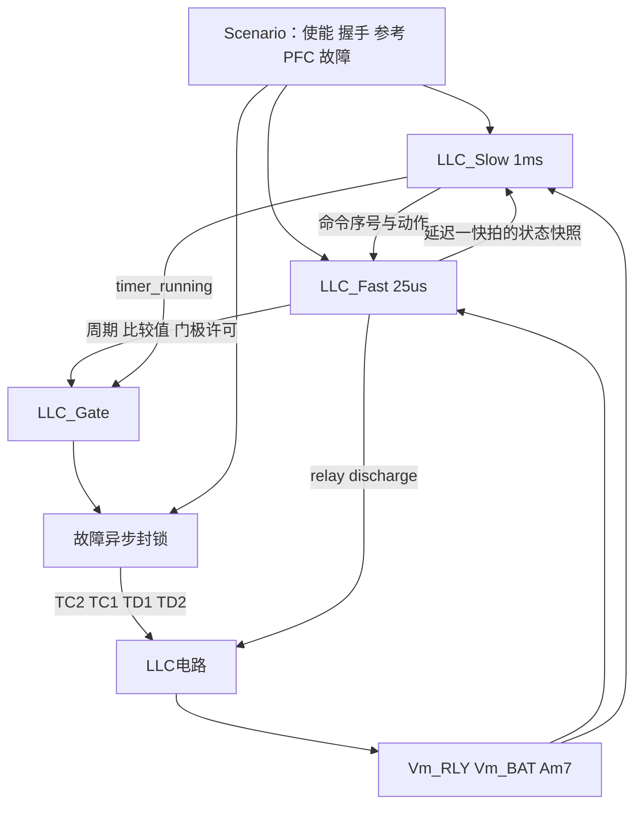

# LLC DLL 移植与 PLECS 接线 Implementation Plan

> 实施更新（2026-09-11）：下文保留原计划与拟议文件拆分。现已生成PWM开发工程、DLL和模型，实际文件采用较集中的控制/慢环源文件组织；完成范围与未完成项见[实施结果](<D:/Work/1600W/代码分析/LLC_Plecs_Port/results/implementation_status.md>)，使用步骤见[工程入口](<D:/Work/1600W/代码分析/LLC_Plecs_Port/README.md>)。PFM/SR库算法仍未完成，不能将全计划标为完成。

> **For agentic workers:** 使用 `superpowers:executing-plans` 按任务逐项执行。以复选框记录实施结果；本计划中的代码片段、工程和测试名称属于后续实施约定，本次仅交付计划，尚未生成这些实现文件。

**Goal:** 将真实固件的启动、PWM恒压/恒流、PFM、模式切换、同步整流与保护移植成可测试的DLL，接入最终LLC模型。

**Architecture:** 先建立DLL独立测试与门极模块，再用一个组合控制DLL建立快慢环对照基线，最后拆成`LLC_Fast.dll`和`LLC_Slow.dll`。门极由独立PLECS事件模块`LLC_Gate`产生。所有跨DLL动作通过显式端口和命令序号传递。

**Tech Stack:** C、Visual Studio 2022/v143参考配置、与本机PLECS位数一致的DLL、PLECS模型与C-Script、C断言测试/Python辅助检查。

**Spec:** [LLC功率控制_DLL移植分析与设计_V1.md](<D:/Work/1600W/代码分析/docs/LLC功率控制_DLL移植分析与设计_V1.md>)。执行时同时阅读设计文档与本计划。

## 全局约束

- 真实控制源：`D:/Work/1600W/代码分析/R02_LLC_APP_V1.1.1_0824`。
- 原模型：`D:/Work/1600W/代码分析/dll_block/LLC1600_PWM - DLL.plecs`。实施在副本进行。
- 新工程根目录约定为`D:/Work/1600W/代码分析/LLC_Plecs_Port`，下文`PORT/`均指该绝对路径。
- 快环固定25μs；慢任务1ms基准，业务状态机5ms；25μs不等于开关周期。
- `Plv/flvOut`按Hz使用，定时器计数频率680MHz；PWM/PFM的Ki按原离散公式使用，不额外乘Ts。
- 第一轮复现9态原逻辑；PFM→PWM自动回切、Burst、恒功率外环、更高电流上限分别作为后续扩展。
- 原始量、快LPF、慢FIR均保留；快慢DLL不能通过可变全局变量或指针信号共享状态。
- ARM库不能直接链接到x64DLL。取得`mComputer/mathTimeHandle/Sr_compute`实现前，可以完成PWM与模型框架，不能宣布真实PFM/SR移植完成。
- 当前参数PWM限10A、PFM限16A；1600W额定验证不属于单纯改变DLL包装即可完成的工作。
- 本次已复核11个基线文件的SHA256，与上一版分析记录一致。

## 1. 实施路线与完成标志

| 步骤 | 要得到的东西 | 完成时能看到什么 | 依赖 |
|---|---|---|---|
| 1 | DLL接口探针与测试模型 | 输入数值回读、计数随25μs增长、四路门极保持关闭 | 无 |
| 2 | 电路改造副本与测量节点 | 继电器前后电压独立，开关/放电可手动控制 | 1 |
| 3 | 比较值计算与LLC_Gate | 固定PWM/PFM四路波形与公式相符 | 1 |
| 4 | 实例化控制内核、采样/PI/复位 | 相同输入回放结果一致，两个实例互不影响 | 1 |
| 5 | PWM恒流和两类恒压 | 80/120/40kHz三类控制分别可测 | 2、3、4 |
| 6 | 启动、预充、继电器流程 | 无握手唤醒、有握手CC、PMS CV完整进入运行 | 5 |
| 7 | PFM增益/SR源实现适配 | PFM环及SR时间可追溯到原实现 | 库源/算法资料、4 |
| 8 | Hold/Transition/PFM联调 | 跨40V后的每个状态、边界拍可解释 | 6、7 |
| 9 | 慢状态机、快慢保护、组合DLL | 自动业务流程及故障恢复，不依赖手动改模式 | 6；全模式联调还需8 |
| 10 | 快慢两个DLL及完整接线 | 与组合DLL按同一调度规则输出一致 | 9 |
| 11 | 回归测试与交付包 | 用例、波形、参数、源码与二进制对应 | 10 |

先执行1–6即可得到有价值的PWM成果。等待库源码时，步骤9中不依赖PFM的部分仍可继续。

## 2. 先确定文件结构和公共接口

### 2.1 拟创建文件

```text
PORT/
  LLC_Plecs_Port.sln
  include/
    llc_api.h                 内核接口、参数及诊断结构
    llc_types.h               从原固件剥离的纯C数据类型
    llc_ports.h               Fast/Slow端口枚举和数量
    llc_context.h             实例内部状态，外部不直接访问
  core/
    llc_context.c             创建、完整复位、销毁
    llc_sample.c              原始量接收、FIR、LPF
    llc_math.c                增量PI、位置PI、滤波、RampToward
    llc_reference.c           PWM/PFM各自的参考限制与缓变
    llc_power_fsm.c           9态分派与reqMode采纳
    llc_pwm_control.c         PWM CC、30V CV、PMS CV
    llc_startup.c             SoftStar/BmsStar/SoftCurSt
    llc_transition.c          PwmHold/Transition
    llc_pfm_control.c         PFM电流环
    llc_sr.c                  PWM SR与恢复后的PFM SR适配
    llc_timer_image.c         原SHRTIMERdrive计算部分
    llc_actuator.c            继电器、泄放、LLC与门极许可状态
    llc_protection_fast.c     快保护和硬故障锁存
    llc_fast_task.c           单次25μs任务
  supervisor/
    llc_command_adapter.c     标准V/A请求与握手映射
    llc_app_fsm.c             operateStatus业务状态机
    llc_supervisor.c          StateM及各慢动作
    llc_protection_slow.c     Relay/Aux保护、RelayOld计时
    llc_slow_task.c           1/5/100ms任务及SysReset许可
  adapters/
    plecs_probe.c             步骤1独立探针，不进入产品DLL
    plecs_fast.c              Fast DLL的四个导出函数
    plecs_slow.c              Slow DLL的四个导出函数
    plecs_combined.c          组合基线DLL
  vendor/plecs/DllHeader.h    对应本机PLECS的ABI头文件
  vendor/sr/                 恢复后的原始SR/增益源码和表
  model/
    LLC1600_PWM_DLL_Port.plecs
    benches/01_DLL_IO.plecs
    benches/02_Plant_IO.plecs
    benches/03_Gate.plecs
    benches/04_PWM_CC.plecs
    benches/05_Startup.plecs
    benches/06_PFM.plecs
    benches/07_Full_System.plecs
    gate/llc_gate_events.c
    gate/llc_gate_events.h
  tests/
    test_math.c, test_sample.c, test_timer.c, test_modes.c
    test_startup.c, test_pfm.c, test_protection.c, test_multirate.c
    test_main.c
  config/port_map.md, scenario_matrix.md, source_map.md
  results/                   逐拍数据、门极边沿、测试结果
  bin/x64/                   DLL发布目录
```

每个`.vcxproj`只包含自己的包装层，核心代码建成同架构静态库`LLC_Core.lib`或按项目显式引用。这里的`LLC_Core.lib`是新建的Windows库，与原ARM `.lib`不同。

### 2.2 公共C接口合同

```c
#include <stdint.h>

enum { LLC_FAST_IN_N=22, LLC_FAST_OUT_N=28,
       LLC_SLOW_IN_N=20, LLC_SLOW_OUT_N=17 };

typedef struct LlcContext LlcContext;
typedef struct LlcSlowContext LlcSlowContext;

typedef struct {
    double fast_ts;             /* 25e-6 */
    double slow_ts;             /* 1e-3 */
    double timer_hz;            /* 680e6 */
    uint32_t abi_version;       /* 1 */
    uint32_t algorithm_profile; /* 0=真实算法; 1=PWM开发配置 */
} LlcConfig;

typedef struct {
    uint32_t pre, c[4], d[4];
    uint8_t drv_h, drv_l, sr_enable;
} LlcTimerImage;

typedef struct {
    float v_relay, v_bat, i_bat;
    float v_relay_lpf, v_bat_lpf, i_bat_lpf;
    float v_bat_fir, i_bat_fir;
} LlcSample;

typedef struct {
    int32_t mode, pre_ok, litate, hold_phase;
    uint32_t mode_ticks, fast_tick, last_command_seq;
    float current_ref, current_limit;
    float v_pi_prev_error, v_pi_oldout;
    float i_pi_prev_error, i_pi_oldout;
    float pfm_integral, pfm_kp, pfm_ki;
    float sr_atime, sr_btime, sr_dtime;
} LlcTrace;

LlcContext *llcCreate(const LlcConfig *cfg);
void llcReset(LlcContext *ctx);
void llcDestroy(LlcContext *ctx);
void llcSampleStep(LlcContext *ctx, float vr, float vb, float ib);
void llcReadSample(const LlcContext *ctx, LlcSample *out);
void llcFastStep(LlcContext *ctx, const double in[22], double out[28]);
void llcReadTrace(const LlcContext *ctx, LlcTrace *out);
int llcBuildPrimaryImage(int pfm, float frequency_hz, float duty,
                         LlcTimerImage *out);

LlcSlowContext *llcSlowCreate(const LlcConfig *cfg);
void llcSlowReset(LlcSlowContext *ctx);
void llcSlowDestroy(LlcSlowContext *ctx);
void llcSlowStep(LlcSlowContext *ctx, const double in[20], double out[17]);
```

`llcBuildPrimaryImage`只计算原边比较值并将其余字段初始化为0；完整的SR计算由`llc_timer_image.c`中的内部函数合成。返回1=有效，0=拒绝频率/占空比或非法窗口。测试中显式调用`llcSampleStep`与调用`llcFastStep`是两种测试方式，正式快环只在`llcFastStep`内部做一次采样。

PWM数学接口另在`llc_api.h`声明，`pi_str`从原`mathR02.h`提取到`llc_types.h`：

```c
float PiPwmCompute(pi_str *p, float err, float kp, float ki);
float Compensator_Pid(pi_str *p, float err);
float RampToward(float ref, float target, float step);
```

## 3. 步骤1：先做能加载、能读写的DLL

**文件：** 创建解决方案、`vendor/plecs/DllHeader.h`、`adapters/plecs_probe.c`、`model/benches/01_DLL_IO.plecs`。使用原REF工程结构，不改其PI算法当作LLC。

**设计：** 一个独立`LLC_Probe.dll`，暂用Fast的22入/28出形状，参数为`[1,25e-6]`，表示接口版本和采样周期。State只有一个测试计数。所有门极许可保持0。

- [ ] 创建x64空DLL工程，加入本机`DllHeader.h`，确认导出函数没有C++名称修饰。
- [ ] 将以下探针代码放入`plecs_probe.c`并构建；它只用于接口验证。

```c
#include "DllHeader.h"

DLLEXPORT void plecsSetSizes(struct SimulationSizes *s) {
    s->numInputs=22; s->numOutputs=28;
    s->numStates=1; s->numParameters=2;
}
DLLEXPORT void plecsStart(struct SimulationState *s) {
    int k;
    for(k=0;k<28;k++) s->outputs[k]=0;
    s->states[0]=0;
    if(s->parameters[0]!=1 || s->parameters[1]!=25e-6)
        s->errorMessage="Probe requires ABI=1 and Ts=25e-6";
}
DLLEXPORT void plecsOutput(struct SimulationState *s) {
    int k;
    for(k=0;k<28;k++) s->outputs[k]=0;
    s->outputs[19]=s->inputs[0]; /* 探针回读，非正式frequency语义 */
    s->outputs[20]=s->inputs[1];
    s->outputs[21]=s->inputs[2];
    s->outputs[26]=s->states[0];
    s->states[0]+=1;
}
```

- [ ] 在01_DLL_IO中放Constant向量、DLL、Scope。输入向量第0/1/2元素设11/22/33，其余0；DLL采样25e-6，延迟0，参数`[1,25e-6]`。
- [ ] 验证out19/20/21=11/22/33，out9/10/11始终0，out26每次回调增长1。重新运行计数从0开始。
- [ ] 用`dumpbin /exports`检查导出`plecsSetSizes/plecsStart/plecsOutput`。删除/改错DLL路径时模型应明确报加载错误，恢复路径后再运行。

**构建命令：** 以下命令在VS x64 Native Tools命令行、`PORT`目录执行。后续相同配置复用。

```powershell
msbuild .\LLC_Plecs_Port.sln /m /p:Configuration=Debug /p:Platform=x64
dumpbin /exports .\bin\x64\LLC_Probe.dll
```

**验收：** DLL加载成功、端口宽度准确、计数与采样一致。此时不接功率管，探针输出不能被误认为真实控制信号。

## 4. 步骤2：改造电路模型，先验证测量与执行器

**文件：** 创建`model/LLC1600_PWM_DLL_Port.plecs`及`benches/02_Plant_IO.plecs`。修改的是原模型副本。

### 4.1 电气节点定义


这里是连接关系示意，实际电压/电流正负仍由测量器端子确定。

- [ ] 复制模型，保留原LLC谐振网络和器件参数。先把原边/SR门极全部接0，电池初始32V。
- [ ] 找到`C15端子1→R16端子1`那一条支路，只断开R16方向的分支，在中间串入`K_RELAY`；保留通往Vm15、R24、L15的支路。
- [ ] 定义C15端子1为`N_RLY`，K_RELAY后/R16端子1为`N_BAT`，输出公共负端为`N_NEG`。新增Vm_RLY和Vm_BAT，正端分别接N_RLY/N_BAT、负端接N_NEG。
- [ ] 保留R16作为电池内阻；从N_RLY另接`R_DIS→K_DIS→N_NEG`。K_DIS受discharge命令控制，勿改用R24/C16充当泄放。
- [ ] 第一轮使用仿真假设：K_RELAY导通电阻1mΩ、初始断开、无机械延时；R_DIS=100Ω、K_DIS初始断开。这些是接口联调值，不作为实际硬件参数。
- [ ] 以Constant/Step手动操作K_RELAY和K_DIS。门极全关且继电器断开时，N_BAT应约32V；N_RLY由输出电容初值决定。继电器合闸后两节点允许存在电阻压降。
- [ ] 检查Am7充电方向；若向电池送能时测值为负，仅在测量信号处加−1增益，并写入`config/port_map.md`。

**独立验证：** 用测试模型的辅助受限电源/初始电容电压检查测量与开关，不用强制开启未知SR去判断方向。无电池唤醒场景需断开电池等效支路并让Vbat测量有确定参考，不能将0V理想电池源直接永久短接输出。

### 4.2 功率与控制总连接



## 5. 步骤3：把比较值变成四路门极

**文件：** `core/llc_timer_image.c`、`model/gate/llc_gate_events.c/.h`、`tests/test_timer.c`、`benches/03_Gate.plecs`。

**输入/输出：** `llcBuildPrimaryImage()`消费PWM/PFM选择、频率Hz、Duty，产出`LlcTimerImage`。先只做原边，SR低电平；恢复SR后仍使用同一个门极模块。

- [ ] 先写以下数值断言并运行，确认在比较值函数尚未实现时测试不能通过；实现后这些断言必须通过。

```c
LlcTimerImage t;
assert(llcBuildPrimaryImage(0,80000.0f,0.1f,&t)==1);
assert(t.pre==8500);
assert(t.c[0]==1700 && t.c[1]==2550);
assert(t.c[2]==5950 && t.c[3]==6800);
assert(llcBuildPrimaryImage(1,250000.0f,0.5f,&t)==1);
assert(t.pre==2720);
assert(t.c[0]==120 && t.c[1]==1240);
assert(t.c[2]==1480 && t.c[3]==2600);
assert(llcBuildPrimaryImage(0,0.0f,0.1f,&t)==0);
```

- [ ] 实现核心公式；检查`isfinite`、正常模式频率范围、整数转换前的范围及比较窗口有序性。非法数据返回0，输出许可为0，不转成uint16溢出值。

```c
/* 仅表示合法输入域内的核心计算；验证先于这些转换执行。 */
uint32_t pre=((uint32_t)(680000000.0f/frequency_hz)) & ~3u;
uint32_t half=pre/2u, quarter=pre/4u;
uint32_t w=(uint32_t)(duty*(float)half);
/* PWM */
out->c[0]=quarter-w; out->c[1]=quarter+w;
out->c[2]=3u*quarter-w; out->c[3]=3u*quarter+w;
/* PFM分支改用 */
out->c[0]=120u; out->c[1]=half-120u;
out->c[2]=half+120u; out->c[3]=pre-120u;
```

实际代码应使用互斥的PWM/PFM分支，不顺次执行上面两组赋值。PWM有效测试域Duty≤0.5；真实控制的各自更窄限制仍在控制环内执行。频率量化在正常范围与原uint16算法保持一致。

### 5.1 LLC_Gate端口

Gate入口为宽度15的向量，所有数组索引从0开始：

| Gate输入 | 来源 | 含义 |
|---|---|---|
| 0 | Fast.out0 | period_ticks |
| 1–4 | Fast.out1–4 | TC1/TC2比较值 |
| 5–8 | Fast.out5–8 | TD1/TD2比较值 |
| 9 | Fast.out9 | DrvH，对应TC2 |
| 10 | Fast.out10 | DrvL，对应TC1 |
| 11 | Fast.out11 | SynDrv，两路SR共同许可 |
| 12 | Fast.out26 | fast_tick，识别新比较值帧 |
| 13 | Slow.out16 | timer_running；步骤3由Constant=1代替 |
| 14 | Scenario.reset | 仿真实例复位 |

| Gate输出 | 物理意义 | 最终接线 |
|---|---|---|
| 0 TC1 | 原边低侧 | 故障封锁后→FETD21控制端 |
| 1 TC2 | 原边高侧 | 故障封锁后→FETD22控制端 |
| 2 TD1 | SR通道1 | 极性测试后确定接FETD23或FETD24 |
| 3 TD2 | SR通道2 | 接剩余SR器件 |

- [ ] 在Gate中保存活动比较值、待提交比较值、当前周期起点、下一个事件时刻、最新fast_tick。
- [ ] 每个25μs采样点接收一帧，边沿事件按tick/680e6换成秒。预装载比较值在周期边界整体提交；不得每次收到频率就在`time % new_period`基础上跳相位。
- [ ] 同时到达新帧和周期边界时，统一按“接收帧→提交比较值→处理该时刻的关断/开通事件”执行；零宽窗口始终低，关断优先于开通。记录该仿真约定，后续与HRTIM行为核对。
- [ ] DrvH/DrvL/SynDrv作为逻辑许可：在控制帧到达时更新，关闭时立即压低对应门极；重新允许时按活动计数窗口决定电平。这保留了GPIO使能可能在半周期中间生效的行为。若要改成仅周期边界开启，应作为波形策略变更单独比较。
- [ ] 原始硬故障另接四个门极末端的组合AND封锁，不等25μs快环。Fast锁存故障后会继续关闭门极许可，故障短脉冲结束不应自行恢复输出。

**C-Script设置草案：** 输入宽度15、输出宽度4、无连续状态，sample time=`[25e-6,0; -2,0]`。第一行接收控制帧，第二行安排边沿事件；使用`IsSampleHit(0/1)`识别。`NextSampleHit`必须严格大于当前时间。保持输出计算可重复，状态更新仅提交一次，不在重复Output调用中累加计数。有关API按[Plexim C-Script文档](https://docs.plexim.com/plecs/latest/c-scripts/)和本机4.9帮助核对；上述事件提交顺序是本项目设计。

**具体状态提交方式：** 输出阶段从已提交状态生成临时候选状态及门极，重复计算不改变历史；Update阶段提交候选状态。NextSampleHit从候选队列的下一个未来事件得出。样本帧与边沿同一时刻到达时，一次处理完所有同刻事件，不重复安排“当前时刻”事件。

### 5.2 怎样验收

先Gate→Scope，不接MOS。在80kHz/Duty=0.1时两路原边各约1.25μs宽、相隔半周期；250kHz PFM时每路导通约1.6471μs，相邻窗口留白约352.94ns。关任一许可时对应门极为0。

再在周期中间从80kHz切250kHz，确认旧周期不被截断成异常长/短周期；故障在导通中间发生时四门极立即低。通过后才将原DT到FETD21/22的门极线整体替换，避免在新Gate后再串旧DT形成重复死区或互补错误。

## 6. 步骤4：提取纯C内核、采样和复位

**文件：** `llc_types.h`、`llc_context.h`、`llc_context.c`、`llc_sample.c`、`llc_math.c`、`tests/test_math.c`、`tests/test_sample.c`。

**设计：** 从原HW/math头文件提取算法需要的类型和宏，不包含stm32/HAL。一个Context对应一个控制实例。原函数内static变量转入Context，不用全局宏指向一个当前实例。

- [ ] 为`PiPwmCompute`、`Compensator_Pid`、`RampToward`写以下独立计算断言。

```c
pi_str p={0};
float d1=PiPwmCompute(&p,0.1f,0.04f,0.001f);
float d2=PiPwmCompute(&p,0.1f,0.04f,0.001f);
assert(fabsf(d1-0.0041f)<1e-7f);
assert(fabsf(d2-0.0001f)<1e-7f);
pi_str q={0}; q.Kp=0.04f; q.Ki=0.001f;
assert(fabsf(Compensator_Pid(&q,0.1f)-0.0041f)<1e-7f);
assert(fabsf(Compensator_Pid(&q,0.1f)-0.0042f)<1e-7f);
assert(fabsf(RampToward(0.0f,1.0f,0.0002f)-0.0002f)<1e-8f);
```

- [ ] 按原float计算顺序迁移函数，再运行上述测试。不要将PWM和PFM合成一个PI。
- [ ] 把原始输入直接写入物理量字段，每快拍执行一次FIR和LPF。首次零状态输入10V时FIR=0.01V，LPF=2.391V；单独验证这个采样函数，不经过会清LPF的NoSelect模式。

```c
LlcConfig cfg={25e-6,1e-3,680e6,1,1};
LlcContext *ctx=llcCreate(&cfg);
assert(ctx!=0);
LlcSample s;
llcSampleStep(ctx,10.0f,10.0f,1.0f);
llcReadSample(ctx,&s);
assert(fabsf(s.v_bat_fir-0.01f)<1e-6f);
assert(fabsf(s.v_bat_lpf-2.391f)<1e-5f);
llcReset(ctx);
llcReadSample(ctx,&s);
assert(s.v_bat_fir==0 && s.v_bat_lpf==0);
llcDestroy(ctx);
```

- [ ] 在`llc_context.h`为所有原static历史定义字段，包括preNum/preChargeTime/2、delay、limRef、delaySr、vtemp和保护计数。完整清零后再设置原本非零初值，例如limRef=0.05。
- [ ] 两个Context分别输入不同电压并运行，再复位其中一个；另一实例的输出必须保持自己的结果。

**接口实现原则：** `llcCreate`拒绝ABI不匹配、非25μs快环、非680MHz计数配置；开发阶段固定这些值，减少系数失配。完成后再增加明确版本的可变参数实验功能。

## 7. 步骤5：分别移植PWM恒流和恒压

**文件：** `llc_pwm_control.c`、`llc_reference.c`、`llc_power_fsm.c`、`llc_actuator.c`、`llc_fast_task.c`、`adapters/plecs_fast.c`、`tests/test_modes.c`、`benches/04_PWM_CC.plecs`。

**函数：** 迁移`ConIdleHandle/ConCurrHandle/ConVoltHandle/ConVoltHandleTwo`、`RefRampPwmCurr`、`DriveSet`。先SR关闭；`PwmSyncDrvUpdate`在后续SR步骤恢复，并将开发配置输出诊断位标记为非完整算法。

- [ ] 写请求映射：输入已是V/A，替换`UpdateCurrentMaxFromCan`的数据来源；BMS/PMS内部原读取点不再乘0.1。
- [ ] 迁移Mode=5的80kHz恒流：请求限10A、参考每拍0.0002A、误差限±0.2A、Duty0.02–0.4及关高侧门槛保持原式。
- [ ] 迁移Mode=4的120kHz/30V恒压，以及SoftCurSt运行部分调用的40kHz PMS CV。两种恒压分别验证，不共用错误的固定频率或PI旧输出。
- [ ] 实现一拍快任务：采样→采纳慢事务→硬故障锁存及原快故障/PFC裁决→状态处理→采纳reqMode→比较值计算→最终许可封锁→输出。事务中的复位动作先判断来源与条件，随后当前有效故障必须重新锁存；测试直入模式也不得越过故障封锁。
- [ ] 构建`LLC_Fast.dll`，替换探针DLL，保持22入/28出。参数数组定义为`[1,25e-6,1e-3,680e6,1]`；第5项1为PWM开发配置，若请求进入缺失PFM功能则报明确错误并关波。
- [ ] 在PWM测试模型中使用`ManualCommand`子系统提供一组标准命令，I_request从0.5A开始逐步增加；为绕过尚未接入的慢启动，仅在该独立测试模型手动合继电器、timer_running=1并提供握手=1。该初态是环路测试，不属于完整启动复现。

**PWM恒流测试输入：** Fast.in0/1/2接真实采样，in3=1、in5=230、in6=0、in7=1、in8=5、in10=0.5、in11=32、in12=1、in13=1、in14=3、in15=0、in16=0、in17=0，其余动作字段按后文事务表设置。不得反复改变command_seq使PI每拍复位。

**验收：** 观察freq=80kHz，参考按原规则增长，Duty受限，两路原边窗口符合步骤3；输出电流的正向变化与参考一致。若立即触发保护，应检查模型初态、采样符号和测试命令，不能直接把保护删除。

**PI限幅测试：** `tests/test_modes.c`通过内核输入回放，检查输入请求20A时PWM CurrentMax=10A；两拍相同命令seq不触发第二次初始化；测试电压39.9/40.0V分别不进入/进入PwmHold。尚未接完过渡分支时，测试应停在模式切换观测点，不让开发空实现继续带功率运行。

## 8. 步骤6：把启动、预充和继电器接回去

**文件：** `llc_startup.c`、`tests/test_startup.c`、`benches/05_Startup.plecs`。

**函数：** `SoftStart`、`SoftCurStart`、`ConVoltCurHandle`。控制继电器与放电不再调用HAL，改成修改Context执行器状态，再输出Fast.out13/out14。

- [ ] 为每条启动路径单独建输入回放，按原比较条件切换Vrelay/Vbat，而不是先靠电路是否自然启动判断逻辑对错。
- [ ] 无握手：Mode=SoftStar，Vrelay从0逐步到30V；检查台阶Duty、RelayOn、关波等待1001拍后请求ConVolt。
- [ ] 有握手CC：Mode=BmsStar，Vbat=32V；使Vrelay依次经过34V、32.5V条件、32.2V条件；严格按原代码的20拍及20000拍计数检查preOK/litate和最终ConCurPWM。
- [ ] PMS CV：Mode=SoftCurSt，请求40V；Vrelay超过请求后检查继电器动作和>1000拍等待，preOK完成后调用ConVoltHandleTwo，模式枚举仍为SoftCurSt。
- [ ] 将ManualCommand中的继电器强制控制解除：Fast.out13接K_RELAY，Fast.out14接K_DIS，测量节点沿用步骤2。
- [ ] 分别运行无电池唤醒、32V CC预充、40V PMS CV预充模型；把模式、preOK、继电器、泄放、Vrelay−Vbat放在同一Scope。

**断言示例：** `tests/test_startup.c`在固定有效条件后计数，等待阈值前一拍不提前跳转；请求Mode事务只发送一次。每次试验调用llcReset后重新初始化测试物理初态。

**验收：** 电路运行与输入回放的状态路径一致，继电器开放时Vrelay不被电池直接钳住；切换动作不因慢命令仍保持RelayOff而被反复撤销。

## 9. 步骤7：补齐PFM增益和同步整流

**文件：** `vendor/sr/`、`llc_pfm_control.c`、`llc_sr.c`、`llc_timer_image.c`、`tests/test_pfm.c`、`benches/06_PFM.plecs`、`config/source_map.md`。

**进入条件：** 取得`mComputer()`、`mathTimeHandle()`、`Sr_compute()`及实际查表数据/算法说明。若未取得，该步骤保持未完成，步骤1–6及PWM慢环继续推进。

- [ ] 核对每个函数读写的全局量和static状态，列入source_map；PFM/SR源码也计算SHA256保存来源。
- [ ] 原查表轴、数据、插值、索引钳位、Kp/Ki和提前/滞后时间单位逐项提取，放进对应Context。不能用PWM增益代填。
- [ ] 先移植PFM电流环、禁用SR：误差`Ibat_LPF−Curr_REF`、位置PI、乘50000、60–250kHz限幅与积分预置保持原式。
- [ ] 写功率参考测试：VacRms=230V、Vbat_FIR=50V、I_request=30A时，功率上限1600W但电流上限应为16A；OTP等级1/2时分别为12A/8A。另选VacRms=90V，应先形成648W/50V=12.96A上限，再施加OTP。
- [ ] 恢复PWM `PwmSyncDrvUpdate`及PFM `mathTimeHandle`，保留SynDrv复写和Sr_Dtime滤波，计算TD1/TD2窗口，禁止将SynDrv=0时的占位比较值变成实际导通。
- [ ] 在低功率、SR关断时先比较两个次级半周的绕组电压/二极管电流，确定每路允许的导通窗口；记录TD1→器件、TD2→器件的实测对应关系，再接SR控制端。
- [ ] SR从关闭到打开分两次试验，检查电流方向、反向电流、提前关断和窗口合法性；没有极性证据时保持SR关，不尝试盲目互换带大功率运行。

**来源验收：** 每一组PFM增益/SR输出至少有数值样本可对照原算法或原固件导出记录。算法只是根据说明重写时，应标注“重实现”，不能直接标为逐值等价。

## 10. 步骤8：验证PWM→PFM全路径

**文件：** `llc_transition.c`、`tests/test_modes.c`、`tests/test_pfm.c`、`benches/06_PFM.plecs`。

- [ ] 迁移`ConPwmHoldHandle/ConTransHandle/ConPfmHandle`及状态机末尾reqMode采纳。
- [ ] 输入Vbat从39.9V升到40.0V，观察ConCurPWM→PwmHold；检查当拍DrvH=0、DrvL=1。
- [ ] 给Ibat_FIR交替低于/高于1A的回放，检查Hold使用“累计满足40次”的原行为，不改为连续40次。
- [ ] 检查phase2另占一拍；Transition计数399/400/401拍时，记录mode、Duty、频率、比较值，确认第400拍已经按PFM窗口计算。
- [ ] PFM运行中将Vbat降到38.9V，期望关波但mode仍OvLoadPFM；握手归0也检查原分支行为。
- [ ] 当前PFM有效握手/电压下，I_request降到0.5A及以下，检查返回Transition；随后恢复请求检查再进入PFM。

**验收：** 逻辑回放先通过，再运行电路跨阈值试验；若电压32V初态直接要求PFM，会被原低压分支关波，这是正确行为而非DLL错误。

## 11. 步骤9：慢环、保护与组合DLL

**文件：** `supervisor/`五个文件、`llc_protection_fast.c`、`adapters/plecs_combined.c`、`tests/test_protection.c`、`tests/test_multirate.c`、`benches/07_Full_System.plecs`。

### 11.1 业务设计

- [ ] 保留`operateStatus.c`的6组业务状态函数，保留`runMainStateMachine→StateM`顺序以及PFC后delay_ini门槛。
- [ ] 将`StateMInit/ConVoWakeup/StandBy/ChargeOn/ChargeFull/StateMErr`中的快状态写入转换为命令事务。事务是“本次要修改哪些字段”，不是把整个Ctrl_interFace复制过去。
- [ ] `llcSlowStep`每1ms只执行一次；内部计数按原SLOW的0/1/2/3/4相位安排：业务每5ms、RelayOld计数每5ms、RelayProtect/AuxProtect每1ms、SysReset每100ms。
- [ ] `SysReset`对HRTIM启动的作用转为`timer_running`；首次允许、PFC掉电、故障清除规则分别记录，不用llc_enable单独代替所有许可。
- [ ] 故障源分成fast_fault_bits和slow_fault_bits；硬故障另有模型直接封锁。将特殊OvFault/OvTime也实例化。保留原注释关闭的保护状态，不擅自启用整张保护表。

### 11.2 命令事务细化

`init_flags`固定定义为动作位图，未置位的字段保持历史：

| bit | 动作 |
|---|---|
| 0 | Curr_REF=0 |
| 1 | preOK=0 |
| 2 | litate=0 |
| 3 | holdPhase/time=0 |
| 4 | 整体清PWM电压PI |
| 5 | 整体清PWM电流PI |
| 6 | 按PowerIniPidVar语义清PFM PI及快LPF |
| 7 | 仅iParamPid.oldout=0 |
| 8 | 仅vParamPid.oldout=0.01 |
| 9 | 按SysReset许可规则申请清故障 |
| 10 | 按starLowIni语义清DriverPwm并关波 |

运行模式内部的PI预置仍在对应Handler内执行。不要为了“统一初始化”额外清原函数没清的字段。若某源动作需要更多数据，应给事务增加明确参数并升级ABI，不能挤入含义不明的位。

`gpio_action_mask`：bit0=Relay、bit1=Discharge、bit2=LLC_enable；值分别来自三个cmd端口。新seq只执行一次。同一seq保持5ms，Fast虽然会读200次，也只能执行一次初始化。

事务函数在输入边界先校验seq、位图和枚举为有效整数，再执行该事务表中的确定动作，最后更新last_command_seq和ack；同序号仅刷新持续参考值，不重复执行动作。模式赋值先于当拍快故障裁决，因此当前故障可以把新请求覆盖成NoSelect。

对应`tests/test_multirate.c`应做三组断言：第一条seq=1/init_flags bit0生效后Curr_REF清零；继续发送seq=1，已有电流爬坡不能再次被清零；改为seq=2并请求同一清零动作，才再次清零。并在seq=2同拍输入Vbat≥62V，检查最终DrvH/DrvL/SynDrv全部为0。通过这些不同结果验证事务只执行一次及故障优先级。

seq=0为初始化“尚无事件”，第一条有效事务为1。标准慢请求值持续更新，更新I/V但不需要初始化时可以不生成新模式事务。

### 11.3 组合DLL合同

`LLC_Combined.dll`以25μs调用，输入23维：前20维按Slow输入表；in20=VacRmsFir、in21=hw_fault_bits、in22=otp_level。前20维中原本来自Fast快照的3–9由组合包装内部填充，模型端填0；in0–2及10–19由实际测量/Scenario提供。

输出45维：out0–27原样Fast输出；out28–44为Slow输出0–16。所以Gate.timer_running取Combined.out44，继电器/泄放仍取out13/14。Combined.in22的OTP等级直接送内部Fast.in6，默认0。

**重要：** Combined为23入/45出，Fast为22入/28出，Slow为20入/17出；三个包装分别使用端口枚举，禁止把DLL文件名互换后保留原Mux/Demux接线。

首次t=0只初始化，首个控制拍t=25μs；每40个控制拍产生一个1ms任务。组合DLL使用与拆分版相同的快照和下一快拍命令采纳规则，避免拆分时才引入延迟变化。

### 11.4 验收

- [ ] 快保护：Vbat≥62V时同一Fast调用输出门极许可全0；RelayOld=1且Vbat<10V、Ibat>10A时短路置位；Ibat>42A时过流置位。
- [ ] 继电器成熟：合闸后399次5ms任务仍不成熟，第400次成熟；原周期不能改成400ms。
- [ ] OvFault恢复：用采样回放保持Vbat≤58V，140000个快拍后允许释放；中途一次越限应重置计数。
- [ ] 慢状态：无握手唤醒、BMS CC、PMS CC/CV、online=3禁能、掉使能、掉握手分别跑通。
- [ ] 保存组合DLL的逐拍输出与Trace，作为步骤10的比较基线。

## 12. 步骤10：拆Fast/Slow并逐线连接

**文件：** `adapters/plecs_fast.c`、`adapters/plecs_slow.c`、`llc_ports.h`、`config/port_map.md`、`tests/test_multirate.c`、最终模型副本。

### 12.1 PLECS块参数

| 块 | 文件名（相对model目录） | 采样 | 输出延迟 | 参数 |
|---|---|---|---|---|
| Fast DLL | `../bin/x64/LLC_Fast.dll` | 25e-6 | 0 | `[1,25e-6,1e-3,680e6,0]` |
| Slow DLL | `../bin/x64/LLC_Slow.dll` | 1e-3 | 1e-9 | `[1,25e-6,1e-3,680e6,0]` |
| Gate C-Script | 模型内子系统 | `[25e-6,0;-2,0]` | 不套DLL输出延迟 | 680e6及事件策略版本 |
| Fast反馈延迟 | 离散Delay | 25e-6，1个sample | 25μs | 初值0向量，长度28 |

Slow的1ns延迟仅用于确定同刻执行顺序，**不是估计的MCU计算时间**；Fast在下一个25μs采样点才采纳新命令。若后续按实测加入Fast计算延迟，Gate接收帧的采样相位必须相应调整，不能仍只在旧25μs边界读新帧。

t=0时Slow只初始化不执行业务计数；t=1ms时Slow读上一已完成快拍快照，t=1ms+1ns发布；Fast在t=1.025ms采纳。将该时序画入Scope验证，不以组件摆放位置推测顺序。

### 12.2 从Slow到Fast的全部连接

表中`in/out`均为DLL数组0基索引。用Mux/Demux把第i个数组元素接到界面第i+1条信号支路；PLECS文本中的SrcTerminal/DstTerminal编号不是DLL数组索引，不能混用。

| Fast输入索引 | 来源 | 单位/说明 |
|---|---|---|
| 0 | Vm_RLY | V |
| 1 | Vm_BAT | V |
| 2 | 校正方向后的Am7 | A |
| 3 | Scenario.pfc_ok | 0/1 |
| 4 | FaultBus.hw_fault_bits | 位图 |
| 5 | Scenario.vac_rms_fir | V交流有效值，初始测试230 |
| 6 | Scenario.otp_level | 0/1/2，默认0 |
| 7 | Slow.out0 | command_seq |
| 8 | Slow.out1 | mode_request |
| 9 | Slow.out2 | init_flags |
| 10 | Slow.out3 | i_request_A |
| 11 | Slow.out4 | v_request_V |
| 12 | Slow.out5 | handshake归一化 |
| 13 | Slow.out6 | 内部CC/CV模式0/1/2 |
| 14 | Slow.out7 | run_state |
| 15 | Slow.out8 | relay_old |
| 16 | Slow.out9 | slow_fault_bits |
| 17 | Scenario.reset | 复位上升沿 |
| 18 | Slow.out10 | gpio_action_mask |
| 19 | Slow.out11 | relay_cmd事件值 |
| 20 | Slow.out12 | discharge_cmd事件值 |
| 21 | Slow.out13 | llc_enable_cmd事件值 |

### 12.3 Fast反馈到Slow的全部连接

先把Fast完整28维输出接一拍Delay，记其输出为`F_prev`；这里只在反馈给Slow的路径使用延迟，门极仍使用当前Fast输出。

| Slow输入索引 | 来源 | 含义 |
|---|---|---|
| 0 | Vm_RLY | 原始Vrelay |
| 1 | Vm_BAT | 原始Vbat |
| 2 | 校正后的Am7 | 原始Ibat |
| 3 | F_prev[21] | Vbat_FIR |
| 4 | F_prev[22] | Ibat_FIR |
| 5 | F_prev[13] | 已应用的继电器逻辑命令 |
| 6 | F_prev[15] | 快模式 |
| 7 | F_prev[16] | preOK |
| 8 | F_prev[24] | OvFault |
| 9 | F_prev[23] | 快故障源 |
| 10 | Scenario.pfc_ok | PFC许可 |
| 11 | Scenario.vac_rms | SysReset使用的交流RMS |
| 12 | Scenario.aux_voltage | 辅源电压，测试默认12V |
| 13 | Scenario.handshake_raw | 0/1/2/3 |
| 14 | Scenario.online | 0/1/2/3；3触发双在线禁能 |
| 15 | Scenario.charge_enable | 选定业务源的有效使能 |
| 16 | Scenario.cv_request_raw | 0=CC、1=CV |
| 17 | Scenario.v_request_V | 标准V |
| 18 | Scenario.i_request_A | 标准A |
| 19 | Scenario.reset | 复位上升沿 |

V/A标准化适配器必须显式保留原先针对0.1单位整数的比较含义。例如原字段`PMS_ChrgReqCur>=1`相当于标准请求≥0.1A；不可移植成标准值≥1A后改变启动门槛。原始CAN多源同时输入属于后续协议扩展，不把这组有效源端口当作完整CAN报文回放。

### 12.4 Fast输出接电路和观测

| Fast输出 | 去向 |
|---|---|
| 0–11 | Gate对应0–11输入 |
| 12 | LLC_en指示/外部使能模型；不拿它单独代替PFC或故障许可 |
| 13 | K_RELAY控制端 |
| 14 | K_DIS控制端 |
| 15、16 | Mode/Precharge Scope |
| 17、18 | I_ref/I_limit Scope |
| 19、20 | Freq/Duty Scope |
| 21、22 | FIR Scope并送一拍反馈Delay |
| 23、24 | 故障Scope并送反馈Delay |
| 25 | CommandAck Scope |
| 26 | Gate.in12及FastTick Scope |
| 27 | Diagnostic Scope |

除13/14为实际逻辑执行器命令外，19/20只是频率/Duty数值，9/10/11只是许可，均不能直接接MOS门极。

### 12.5 模型端封锁

四路Gate输出各接一个AND，与`!hw_trip`相与后接对应MOS。`hw_trip`来自模型硬件比较器或故障注入；该条件不通过Slow。

为复现快速中断锁存前的持续封锁，FaultBus同时将事件送Fast.in4；Fast接收后置故障并输出关闭许可。只注入一个短于采样周期的硬故障时，应在FaultBus中增加事件锁存，直到Fast回报已识别，避免软件完全漏采该事件。

GPIO使能、周期计数是否启动和硬件故障是不同信号，不能简单把四门极都与`LLC_en`一项相与后删除其余许可。

### 12.6 拆分验收

- [ ] Fast与Slow各自使用自己的Context，均具备Start/Terminate完整生命周期。
- [ ] 同一seq只采纳一次；更改I_request但不改mode事务时，参考仍能持续跟随。
- [ ] 1ms边界记录Slow发布与Fast采纳时间，检查不出现同拍竞态或200次重复初始化。
- [ ] `test_multirate.c`用同一组输入，分别运行组合包装调度和Fast/Slow独立调用调度；同一设计时刻的mode、seq、许可、整数比较值完全一致。
- [ ] 两个完整控制实例并行接两个独立电路，改变其中一组请求不得改变另一组状态。

## 13. 步骤11：回归用例、构建及交付

**文件：** `config/scenario_matrix.md`、`results/`、`tests/test_main.c`及所有已定义测试文件、Release二进制与模型。

所有C测试由`LLC_Core_Tests.exe`统一执行，测试入口包含`assert.h/math.h/llc_api.h/llc_types.h`。测试失败返回非零状态；测试配置不定义NDEBUG，不能在关闭assert的发布配置下声称测试通过。

```powershell
msbuild .\LLC_Plecs_Port.sln /m /p:Configuration=Debug /p:Platform=x64
.\bin\x64\LLC_Core_Tests.exe
msbuild .\LLC_Plecs_Port.sln /m /p:Configuration=Release /p:Platform=x64
dumpbin /exports .\bin\x64\LLC_Fast.dll
dumpbin /exports .\bin\x64\LLC_Slow.dll
```

生产DLL的`plecsSetSizes/plecsStart/plecsOutput/plecsTerminate`全部实现。Start只用parameters初始化，不读inputs；所有输出初始为确定值。参数非法时设置errorMessage并关闭输出。DLL位数、导出、结构打包与本地头文件核对，加载中的DLL更新应先结束仿真再重新加载。

### 必须跑的场景

| ID | 场景 | 必须保存的证据 |
|---|---|---|
| R01 | 无电池无握手→30V唤醒 | Mode/Relay/Discharge/Vrelay |
| R02 | 32V电池、BMS、0.5→5A请求 | 预充、80kHzPWM、Iref/Ibat |
| R03 | PMS CV 30/40/50V | 40kHzCV、参考与输出、动态Duty上限 |
| R04 | 48V电池、高压CC启动 | Transition/PFM及增益/SR来源版本 |
| R05 | Vbat跨40V | Hold累计条件、Transition边界、四门极 |
| R06 | PFM电压降到38.9V | 关波但维持PFM枚举的原行为 |
| R07 | AC RMS下降、OTP注入 | 功率限流值、16A钳位、0.75/0.5倍率 |
| R08 | 掉使能/握手/online=3/PFC掉落 | 命令、状态、全部执行器 |
| R09 | OVP/OCP/短路/硬故障脉冲 | 原始采样、故障位、门极封锁时刻 |
| R10 | 继电器失效、泄放状态异常 | 节点差压、RelayOld、慢故障 |
| R11 | 故障清除及重新启动 | 特殊OvFault计数与业务恢复计数 |
| R12 | 重复仿真、双实例、保存恢复 | 状态无串扰；若采用userData且尚未实现保存恢复，明确该功能不支持 |

初期电气性能先形成测量记录，不编造过冲/稳态误差合格阈值。软件接口、状态、窗口和比较值有确定断言；实际电气性能按项目指标冻结后判定。

完整启动可超过2–5s；ns级门极短窗口与秒级业务测试分开运行。逻辑回放可高效验证140000拍保护恢复；电路长时仿真不能通过把25μs控制周期改小来加速。

- [ ] 先保存Debug内核测试结果，再构建Release并在PLECS运行关键闭环与故障场景。
- [ ] 归档源文件/参数/DLL哈希、软件版本、模型初态、场景编号、输出CSV和Scope波形。
- [ ] README标明哪些场景使用真实SR源码，哪些是SR关闭的开发配置；保留模型相对DLL路径，换目录后重载验证。
- [ ] 输出已知差异表：定时器更新约定、指令跨速率延迟、仿真继电器/泄放参数、尚未新增的反向切换/Burst/恒功率。

## 14. 第一轮实际执行范围

第一轮建议只完成步骤1–3，交付三个可独立打开的测试模型：DLL输入输出、继电器/采样、四路门极。通过后执行4–6移植PWM与启动。

这样每一轮都有清楚的判据：

1. **DLL是否能加载、按25μs调用？** 由01_DLL_IO计数与回读回答。
2. **采样节点与执行器是否接对？** 由02_Plant_IO的Vrelay/Vbat和手动继电器回答。
3. **门极是不是固件要求的波形？** 由03_Gate的比较值和边沿时间回答。
4. **算法是否按原始行为工作？** 由后续内核回放、模式Trace和闭环场景回答。

本计划无需等待PFM/SR源码就能开始上述第一轮；完整PFM与SR的验收则必须满足步骤7的来源条件。
